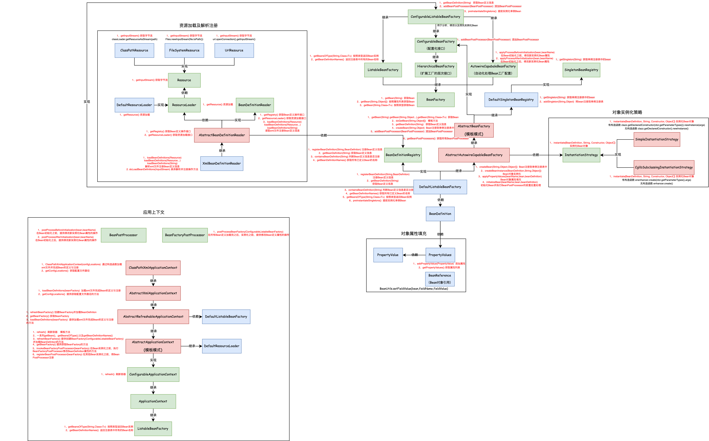
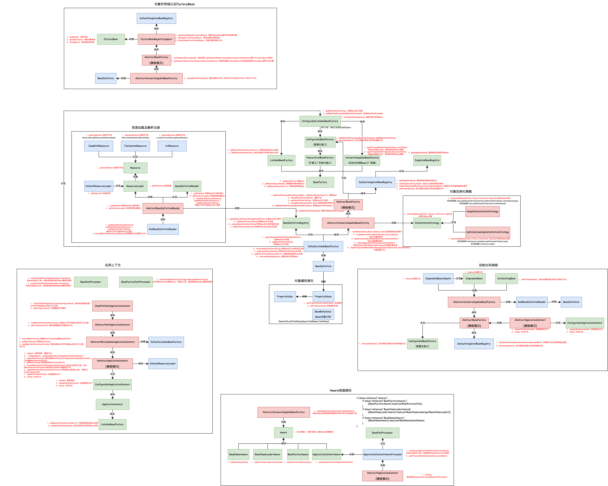

# 手写Spring

[TOC]

# IOC

## Step01：创建简单的Bean容器 

### 准备：

1. IOC：控制反转，简单来说就是一个对象定义其依赖关系而不创建它们的过程。 
2. Bean规范：所有属性都是private，提供默认构造、getter、setter方法的公共类。
3. Bean：是符合Bean规范的Java对象。 
4. Spring Bean 容器：管理对象及其依赖，以及依赖的注入。 

### 设计：

Spring Bean 容器场景下，选择HashMap作为存放数据的具体数据结构。 

1. 定义Bean 
2. 注册Bean 
3. 根据key值获取Bean

### 实现： 

BeanDefinition ：

1. 定义Bean ： 定义一个Object类型存放对象，通过构造函数传入 

BeanFactory：

1. 注册Bean：通过 HashMap 存放定义好的Bean即 BeanDefinition
2. 获取Bean：通过 key 值 即 Bean 的名字，取出注册好的Bean


### 测试：

```java
public class ApiTest {

    @Test
    public void test_beanFactory(){

        // 初始化Bean工厂
        BeanFactory beanFactory = new BeanFactory();

        // 定义 bean
        BeanDefinition beanDefinition = new BeanDefinition(new UserService());

        // 注册 bean
        beanFactory.registerBeanDefinition("userService",beanDefinition);

        // 获取bean
        UserService userService = (UserService) beanFactory.getBean("userService");

        userService.queryUserInfo();
    }

}
```

## Step02：实现Bean的定义、注册、获取


### 测试：

```java
public class ApiTest {

    @Test
    public void test_beanFactory(){

        // 初始化Bean工厂
        DefaultListableBeanFactory beanFactory = new DefaultListableBeanFactory();

        // 定义 bean
        BeanDefinition beanDefinition = new BeanDefinition(UserService.class);

        // 注册 bean
        beanFactory.registerBeanDefinition("userService",beanDefinition);

        // 获取bean
        UserService userService = (UserService) beanFactory.getBean("userService");

        userService.queryUserInfo();

        UserService userService_singleton = (UserService) beanFactory.getBean("userService");

        userService_singleton.queryUserInfo();
    }

}
```

## Step03：解决含有构造函数的Bean对象的实例化，加入对象实例化策略

### 实现： 

1. 在BeanFactory上重载getBean函数，增加构造函数的入参信息，方便实例化。 

2. 创建实例化策略接口，目前有两种方式：JDK自带的方法DeclaredConstructor和Cglib动态创建 

3. 定义两种实例化策略的具体实现。 

4. 创建策略调用，首先通过beanClass.getDeclaredConstructors()获取bean对象的所有构造函数，这里简单比对入参个数与构造函数的参数个数是否一致，来选择需要具体实例化的对象。 

   ```java
   protected Object createBeanInstance(BeanDefinition beanDefinition, String beanName, Object[] args) {
     Constructor constructorToUse = null;
     Class<?> beanClass = beanDefinition.getBeanClass();
     Constructor<?>[] declaredConstructors = beanClass.getDeclaredConstructors(); // 获取所有构造函数
     for (Constructor ctor : declaredConstructors) {
       if (null != args && ctor.getParameterTypes().length == args.length) { // 简单比对入参个数
         constructorToUse = ctor;
         break;
       }
     }
     return getInstantiationStrategy().instantiate(beanDefinition, beanName, constructorToUse, args);
   }
   ```

### 结果： 

1. 通过第三章和第四章的学习，感受到了一个好的代码结构设计对于整个工程的重要性，这直接决定后期维护与扩展是否可行便利。


## Step04：解决含有属性的Bean对象的实例化，在实例化之后填充属性

### 实现： 

1. 定义属性类PropertyValue以及PropertyValues，用于传递Bean对象中的属性信息。
2. 定义Bean对象引用类BeanReference，用于后续对象属性为bean对象时的实例化以及属性填充。 
3. 补全Bean定义，加入PropertyValues属性，便于Bean注册时传递属性信息。 
4. 在对象实例化之后，通过其定义信息获取属性列表，循环进行填充操作。当遇到BeanReference时，即存在依赖时，需要递归获取该引用的实例化，进而填充属性。 

```java
/**
 * Bean 属性填充
 */
protected void applyPropertyValues(String beanName, Object bean, BeanDefinition beanDefinition) {
  try {
    PropertyValues propertyValues = beanDefinition.getPropertyValues();
    for (PropertyValue propertyValue : propertyValues.getPropertyValues()) {
      
      String name = propertyValue.getName();
      Object value = propertyValue.getValue();

      if (value instanceof BeanReference) {
        // A 依赖 B，获取 B 的实例化
        BeanReference beanReference = (BeanReference) value;
        value = getBean(beanReference.getBeanName());
      }
      // 属性填充
      BeanUtil.setFieldValue(bean, name, value);
      }
  } catch (Exception e) {
    throw new BeansException("Error setting property values：" + beanName);
  }
}
```

### 测试：

```java
public class ApiTest {

    @Test
    public void test_BeanFactory() {
        // 1.初始化 BeanFactory
        DefaultListableBeanFactory beanFactory = new DefaultListableBeanFactory();

        // 2. UserDao 注册
        beanFactory.registerBeanDefinition("userDao", new BeanDefinition(UserDao.class));

        // 3. UserService 设置属性[uId、userDao]
        PropertyValues propertyValues = new PropertyValues();
        propertyValues.addPropertyValue(new PropertyValue("uId", "10002"));
        propertyValues.addPropertyValue(new PropertyValue("userDao",new BeanReference("userDao")));

        // 4. UserService 注入bean
        BeanDefinition beanDefinition = new BeanDefinition(UserService.class, propertyValues);
        beanFactory.registerBeanDefinition("userService", beanDefinition);

        // 5. UserService 获取bean
        UserService userService = (UserService) beanFactory.getBean("userService");
        userService.queryUserInfo();
    }
}
```

### 结果：

1. 在最后测试中，报出异常  *Instantiation of bean failed*  ，经过单步调试之后，发现是由于存在依赖关系(A依赖于B)，递归获取实例化时，因为 B 注册 Bean 定义信息时并无属性列表，从而导致填充属性获取属性列表时，报空指针异常，导致  *Error setting property values* 异常，进而抛出 上级异常 *Instantiation of bean failed* 。发现问题之后，第一时间想到的 if..else ，结果也是成功输出。回过头来看，可以在 BeanDefinition 的构造函数上做优化，当没有属性列表或属性列表为空时，直接new 实例化属性列表，从而解决空指针异常，程序也就能正常运行。

   ```java
   public BeanDefinition(Class beanClass, PropertyValues propertyValues) {
     this.beanClass = beanClass;
     this.propertyValues = propertyValues != null ? propertyValues : new PropertyValues();
   }
   ```


## Step05：解放双手，利用资源加载器解析xml文件注册Bean定义信息，简化创建过程

### 实现： 

1. 定义Resource接口，提供获取字节流的方法。 

2. 实现Resoure接口。获取三种不同文件流操作。  

   - ClassPath：classLoader.getResourceAsStream(path)

   - FileSystem：Files.newInputStream(this.file.toPath())

   - URL：this.url.openConnection().getInputStream() 

3. 包装资源加载器，将三种资源加载方式集中到统一的接口下进行处理。

   1. 定义资源加载接口ResourceLoader，提供获取资源的方法。 
   2. 实现资源加载接口ResourceLoader，判断地址类型从而获取对应的资源。 

4. 定义 加载Bean定义 接口 BeanDefinitionLoader，提供 获取Bean定义的注册信息 getRegistry() ，getResourceLoader() 资源加载 以及 三个加载Bean定义的方法。 

5. 定义读取Bean定义的抽象类 AbstractBeanDefinitionReader，通过构造函数的形式让调用方将BeanDefinitionRegistry和ResourceLoader传递进来，从而实现接口 的 获取Bean定义注册getRegistry()以及getResourceLoader()资源加载 方法，这样将三个加载Bean定义的方法所需要用到的工具，事先交给抽象类实现，保证了三个具体操作不被污染。

6. 创建xml文件处理类 XmlBeanDefinitionReader，通过继承 AbstractBeanDefinitionReader 抽象类，实现三个加载Bean定义的方法，通过解析xml文件定义并注册Bean。 

   ```java
   protected void doLoadBeanDefinitions(InputStream inputStream) throws ClassNotFoundException {
     Document doc = XmlUtil.readXML(inputStream);
     Element root = doc.getDocumentElement();
     NodeList childNodes = root.getChildNodes();
   
     for (int i = 0; i < childNodes.getLength(); i++) {
       // 判断元素
       if (!(childNodes.item(i) instanceof Element)) continue;
       // 判断对象
       if (!"bean".equals(childNodes.item(i).getNodeName())) continue;
   
       // 解析标签
       Element bean = (Element) childNodes.item(i);
       String id = bean.getAttribute("id");
       String name = bean.getAttribute("name");
       String className = bean.getAttribute("class");
       // 获取 Class，方便获取类中的名称
       Class<?> clazz = Class.forName(className);
       // 优先级 id > name
       String beanName = StrUtil.isNotEmpty(id) ? id : name;
       if (StrUtil.isEmpty(beanName)) {
         beanName = StrUtil.lowerFirst(clazz.getSimpleName());
       }
   
       // 定义Bean
       BeanDefinition beanDefinition = new BeanDefinition(clazz);
       // 读取属性并填充
       for (int j = 0; j < bean.getChildNodes().getLength(); j++) {
         if (!(bean.getChildNodes().item(j) instanceof Element)) continue;
         if (!"property".equals(bean.getChildNodes().item(j).getNodeName())) continue;
         // 解析标签：property
         Element property = (Element) bean.getChildNodes().item(j);
         String attrName = property.getAttribute("name");
         String attrValue = property.getAttribute("value");
         String attrRef = property.getAttribute("ref");
         // 获取属性值：引入对象、值对象
         Object value = StrUtil.isNotEmpty(attrRef) ? new BeanReference(attrRef) : attrValue;
         // 创建属性信息
         PropertyValue propertyValue = new PropertyValue(attrName, value);
         beanDefinition.getPropertyValues().addPropertyValue(propertyValue);
       }
       // 检查是否重复注册
       if (getRegistry().containsBeanDefinition(beanName)) {
         throw new BeansException("Duplicate beanName[" + beanName + "] is not allowed");
       }
       // 注册 BeanDefinition
       getRegistry().registerBeanDefinition(beanName, beanDefinition);
     }
   }
   ```

7. 对目前spring框架的优化： 

   - 对 BeanFactory 接口，新增按照类型获取Bean的方法。 
   - 新增 ListableBeanFactory 接口，继承 BeanFactory 接口，提供 按照类型返回 Bean 实例 以及 返回注册表中所有的Bean名称 的方法。 
   - 新增 HierarchicalBeanFactory 接口，继承 BeanFactory 接口，属于扩展工厂的层次子接口。 
   - 新增 AutowireCapableBeanFactory 接口，继承 BeanFactory 接口，用于自动化处理工厂配置。 
   - 新增 ConfigurableBeanFactory 接口，用于获取BeanPostProcessor,BeanClassLoader 等一系列的配置 
   - 新增 ConfigurableListableBeanFactory 接口，提供分析、修改以及预先实例化Bean的操作方法。
   - 令 DefaultListableBeanFactory 实现 ConfigurableListableBeanFactory ， 新增 查询是否包含指定beanDefinition 、按照指定类型获取Bean 以及 获取所有 BeanDefinitionNames。

### 测试：

**spring.xml**

```xml
<?xml version="1.0" encoding="UTF-8"?>
<beans>

    <bean id="userDao" class="cn.ray.springframework.bean.UserDao"/>

    <bean id="userService" class="cn.ray.springframework.bean.UserService">
        <property name="uId" value="10001"/>
        <property name="userDao" ref="userDao"/>
    </bean>

</beans>
```

**ApiTest**

```java
package cn.ray.springframework;

import cn.hutool.core.io.IoUtil;
import cn.ray.springframework.bean.UserDao;
import cn.ray.springframework.bean.UserService;
import cn.ray.springframework.beans.PropertyValue;
import cn.ray.springframework.beans.PropertyValues;
import cn.ray.springframework.beans.factory.config.BeanDefinition;
import cn.ray.springframework.beans.factory.config.BeanReference;
import cn.ray.springframework.beans.factory.support.DefaultListableBeanFactory;
import cn.ray.springframework.beans.factory.xml.XmlBeanDefinitionReader;
import cn.ray.springframework.core.io.DefaultResourceLoader;
import cn.ray.springframework.core.io.Resource;
import org.junit.Before;
import org.junit.Test;

import java.io.IOException;
import java.io.InputStream;

/**
 * @author JOJO
 * @date 2022/8/17 15:26
 */
public class ApiTest {

    @Test
    public void test_BeanFactory() {
        // 1.初始化 BeanFactory
        DefaultListableBeanFactory beanFactory = new DefaultListableBeanFactory();

        // 2. UserDao 注册
        beanFactory.registerBeanDefinition("userDao", new BeanDefinition(UserDao.class));

        // 3. UserService 设置属性[uId、userDao]
        PropertyValues propertyValues = new PropertyValues();
        propertyValues.addPropertyValue(new PropertyValue("uId", "10001"));
        propertyValues.addPropertyValue(new PropertyValue("userDao", new BeanReference("userDao")));

        // 4. UserService 注入bean
        BeanDefinition beanDefinition = new BeanDefinition(UserService.class, propertyValues);
        beanFactory.registerBeanDefinition("userService", beanDefinition);

        // 5. UserService 获取bean
        UserService userService = (UserService) beanFactory.getBean("userService");
        String result = userService.queryUserInfo();
        System.out.println("测试结果：" + result);
    }

    private DefaultResourceLoader resourceLoader;

    @Before
    public void init() {
        resourceLoader = new DefaultResourceLoader();
    }

    @Test
    public void test_classpath() throws IOException {
        Resource resource = resourceLoader.getResource("classpath:important.properties");
        InputStream inputStream = resource.getInputStream();
        String content = IoUtil.readUtf8(inputStream);
        System.out.println(content);
    }

    @Test
    public void test_xml() {
        // 1.初始化 BeanFactory
        DefaultListableBeanFactory beanFactory = new DefaultListableBeanFactory();

        // 2. 读取配置文件&注册Bean
        XmlBeanDefinitionReader reader = new XmlBeanDefinitionReader(beanFactory);
        reader.loadBeanDefinitions("classpath:spring.xml");

        // 3. 获取Bean对象调用方法
        UserService userService = beanFactory.getBean("userService", UserService.class);
        String result = userService.queryUserInfo();
        System.out.println("测试结果：" + result);
    }
}

```


## Step06：应用上下文，对Bean的实例化过程进行扩展

### 实现：

1. 定义两个扩展接口。 

   - BeanFactoryPostProcessor：提供在Bean对象定义注册后实例化前，对Bean定义的属性进行修改的操作。 
   - BeanPostProcessor：提供在Bean对象实例化后对Bean直接进行修改的操作。分为Bean对象初始化前与Bean对象初始化后。 

2. 定义 ApplicationContext 上下文接口，继承于ListableBeanFactory，用于获取父类上下文。 

3. 定义 ConfigurableApplicationContext 接口，继承于ApplicationContext，提供 refresh() 刷新容器的方法。

4. 定义 AbstractApplicationContext 抽象类，实现ConfigurableApplicationContext接口，实现refresh方法。并继承DefaultResourceLoader以加载xml文件，从而实现Bean的定义注册。另外，AbstractApplicationContext 抽象类提供 refreshBeanFactory(）创建 BeanFactory，并加载 BeanDefinition以及getBeanFactory() 获取Bean工厂方法供继承类实现。 

   refresh 刷新容器的实现过程：

   1. 创建 BeanFactory，并通过 XML 文件加载 BeanDefinition 
   2. 获取 BeanFactory 
   3. 在 Bean 实例化之前，执行 BeanFactoryPostProcessor 
   4. BeanPostProcessor 需要提前于其他 Bean 对象实例化之前执行注册操作，从而保证在实例化过程能正常获取到BeanPostProcessor以达到自定义修改Bean的效果。
   5. 提前实例化单例Bean对象

5.  定义 AbstractRefreshableApplicationContext 抽象类，继承于AbstractApplicationContext 抽象类，实现refreshBeanFactory(）创建 BeanFactory，并加载 BeanDefinition以及getBeanFactory() 获取Bean工厂方法，并提供loadBeanDefinitions(DefaultListableBeanFactory) 加载xml文件定义并注册Bean对象 方法供继承类实现。 

6. 定义 AbstractXmlApplicationContext 抽象类，继承于AbstractRefreshableApplicationContext 抽象类，实现loadBeanDefinitions(DefaultListableBeanFactory)  加载xml文件定义并注册Bean对象 方法，并提供 getConfigLocations() 方法 从入口上下文处获取配置文件路径。 

7. 创建 ClassPathXmlApplicationContext 应用上下文实现类，继承于AbstractXmlApplicationContext 抽象类，实现 getConfigLocations() 方法，返回配置文件路径，使资源加载能够正常执行。并且这里通过构造函数的方式拿到配置文件路径去调用层层继承下来的refresh() 刷新容器的方法，从而实现Bean对象的扩展。

8. 补全 AutowireCapableBeanFactory 接口，增加 执行BeanPostProcessor 前置和后置的方法。 

9. 补全 AbstractAutowireCapableBeanFactory 类，在实例化Bean之后添加执行Bean的初始化方法以及执行BeanPostProcessor 前置和后置方法。 

   ```java
   package cn.ray.springframework.beans.factory.support;
   
   import cn.hutool.core.bean.BeanUtil;
   import cn.ray.springframework.beans.BeansException;
   import cn.ray.springframework.beans.PropertyValue;
   import cn.ray.springframework.beans.PropertyValues;
   import cn.ray.springframework.beans.factory.config.AutowireCapableBeanFactory;
   import cn.ray.springframework.beans.factory.config.BeanDefinition;
   import cn.ray.springframework.beans.factory.config.BeanPostProcessor;
   import cn.ray.springframework.beans.factory.config.BeanReference;
   
   import java.lang.reflect.Constructor;
   
   /**
    * @author JOJO
    * @date 2022/8/15 17:47
    */
   public abstract class AbstractAutowireCapableBeanFactory extends AbstractBeanFactory implements AutowireCapableBeanFactory {
   
       private InstantiationStrategy instantiationStrategy = new CglibSubclassingInstantiationStrategy();
   
       public InstantiationStrategy getInstantiationStrategy() {
           return instantiationStrategy;
       }
   
       public void setInstantiationStrategy(InstantiationStrategy instantiationStrategy) {
           this.instantiationStrategy = instantiationStrategy;
       }
   
       @Override
       protected Object createBean(String beanName, BeanDefinition beanDefinition, Object[] args) throws BeansException {
           Object bean = null;
           try {
               bean = createBeanInstance(beanDefinition, beanName, args);
               applyPropertyValues(beanName, bean, beanDefinition);
               // 执行 Bean 的初始化方法和 BeanPostProcessor 的前置和后置处理方法
               bean = initializeBean(beanName,bean,beanDefinition);
           } catch (Exception e) {
               throw new BeansException("Instantiation of bean failed");
           }
           addSingleton(beanName, bean);
           return bean;
       }
   
       protected Object createBeanInstance(BeanDefinition beanDefinition, String beanName, Object[] args) {
           Constructor constructorToUse = null;
           Class<?> beanClass = beanDefinition.getBeanClass();
           Constructor<?>[] declaredConstructors = beanClass.getDeclaredConstructors(); // 获取构造函数的个数
           for (Constructor ctor : declaredConstructors) {
               if (null != args && ctor.getParameterTypes().length == args.length) { // 简单比对入参个数
                   constructorToUse = ctor;
                   break;
               }
           }
           return getInstantiationStrategy().instantiate(beanDefinition, beanName, constructorToUse, args);
       }
   
       /**
        * Bean 属性填充
        */
       protected void applyPropertyValues(String beanName, Object bean, BeanDefinition beanDefinition) {
           try {
               PropertyValues propertyValues = beanDefinition.getPropertyValues();
               for (PropertyValue propertyValue : propertyValues.getPropertyValues()) {
   
                   String name = propertyValue.getName();
                   Object value = propertyValue.getValue();
   
                   if (value instanceof BeanReference) {
                       // A 依赖 B，获取 B 的实例化
                       BeanReference beanReference = (BeanReference) value;
                       value = getBean(beanReference.getBeanName());
                   }
                   // 属性填充
                   BeanUtil.setFieldValue(bean, name, value);
               }
           } catch (Exception e) {
               throw new BeansException("Error setting property values：" + beanName);
           }
       }
   
       private Object initializeBean(String beanName, Object bean, BeanDefinition beanDefinition) {
           // 1. 执行 BeanPostProcessor Before 处理
           Object wrappedBean = applyBeanPostProcessorsBeforeInitialization(bean, beanName);
   
           // 待完成内容：invokeInitMethods(beanName, wrappedBean, beanDefinition);
           invokeInitMethods(beanName, wrappedBean, beanDefinition);
   
           // 2. 执行 BeanPostProcessor After 处理
           wrappedBean = applyBeanPostProcessorsAfterInitialization(wrappedBean, beanName);
           return wrappedBean;
       }
   
       private void invokeInitMethods(String beanName, Object wrappedBean, BeanDefinition beanDefinition) {
   
       }
   
       @Override
       public Object applyBeanPostProcessorsBeforeInitialization(Object existingBean, String beanName) throws BeansException {
           Object result = existingBean;
           for (BeanPostProcessor processor : getBeanPostProcessors()) {
               Object current = processor.postProcessBeforeInitialization(result, beanName);
               if (null == current) return result;
               result = current;
           }
           return result;
       }
   
       @Override
       public Object applyBeanPostProcessorsAfterInitialization(Object existingBean, String beanName) throws BeansException {
           Object result = existingBean;
           for (BeanPostProcessor processor : getBeanPostProcessors()) {
               Object current = processor.postProcessAfterInitialization(result, beanName);
               if (null == current) return result;
               result = current;
           }
           return result;
       }
   }
   ```

### 结果： 

整个流程概括来讲核心就是 refresh() 方法。 

1. 首先通过 ClassPathXmlApplicationContext 上下文实现类入口，进入refresh()方法。

2. 之后，创建BeanFactory，定义并注册Bean 

3. 获取到Beanfactory之后，执行定义的 BeanFactoryPostProcessor，以此修改Bean定义的属性信息。 

4. 在此之后，将定义的 BeanPostProcessor 注册到容器中。 

5. 最后，提前实例化Bean，由已经注册的 BeanPostProcessor 来修改 实例化后的Bean信息。 

   Tips：BeanFactoryPostProcessor 和 BeanPostProcessor 本身也是 Bean。

```java
package cn.ray.springframework.context.support;

import cn.ray.springframework.beans.BeansException;
import cn.ray.springframework.beans.factory.ConfigurableListableBeanFactory;
import cn.ray.springframework.beans.factory.config.BeanFactoryPostProcessor;
import cn.ray.springframework.beans.factory.config.BeanPostProcessor;
import cn.ray.springframework.context.ConfigurableApplicationContext;
import cn.ray.springframework.core.io.DefaultResourceLoader;

import java.util.Map;

/**
 * @author JOJO
 * @date 2022/8/21 22:50
 */
public abstract class AbstractApplicationContext extends DefaultResourceLoader implements ConfigurableApplicationContext {

    @Override
    public void refresh() throws BeansException {
        // 1. 创建 BeanFactory，并加载 BeanDefinition
        // 1.1  ClassPathXmlApplicationContext ->  getConfigLocations()
        // 1.2  AbstractXmlApplicationContext  ->  loadBeanDefinitions(DefaultListableBeanFactory beanFactory)
        // 1.3  AbstractRefreshableApplicationContext  ->  refreshBeanFactory()
        refreshBeanFactory();

        // 2. 获取 BeanFactory
        ConfigurableListableBeanFactory beanFactory = getBeanFactory();

        // 3. 在 Bean 实例化之前，执行 BeanFactoryPostProcessor (Invoke factory processors registered as beans in the context.)
        invokeBeanFactoryPostProcessors(beanFactory);

        // 4. BeanPostProcessor 需要提前于其他 Bean 对象实例化之前执行注册操作
        registerBeanPostProcessors(beanFactory);

        // 5. 提前实例化单例Bean对象，方便之后使用
        beanFactory.preInstantiateSingletons();
    }

    protected abstract void refreshBeanFactory() throws BeansException;

    protected abstract ConfigurableListableBeanFactory getBeanFactory();

    private void invokeBeanFactoryPostProcessors(ConfigurableListableBeanFactory beanFactory) {
        Map<String, BeanFactoryPostProcessor> beanFactoryPostProcessorMap = beanFactory.getBeansOfType(BeanFactoryPostProcessor.class);
        for (BeanFactoryPostProcessor beanFactoryPostProcessor : beanFactoryPostProcessorMap.values()) {
            beanFactoryPostProcessor.postProcessBeanFactory(beanFactory);
        }
    }

    private void registerBeanPostProcessors(ConfigurableListableBeanFactory beanFactory) {
        Map<String, BeanPostProcessor> beanPostProcessorMap = beanFactory.getBeansOfType(BeanPostProcessor.class);
        for (BeanPostProcessor beanPostProcessor : beanPostProcessorMap.values()) {
            beanFactory.addBeanPostProcessor(beanPostProcessor);
        }
    }

    @Override
    public <T> Map<String, T> getBeansOfType(Class<T> type) throws BeansException {
        return getBeanFactory().getBeansOfType(type);
    }

    @Override
    public String[] getBeanDefinitionNames() {
        return getBeanFactory().getBeanDefinitionNames();
    }

    @Override
    public Object getBean(String name) throws BeansException {
        return getBeanFactory().getBean(name);
    }

    @Override
    public Object getBean(String name, Object... args) throws BeansException {
        return getBeanFactory().getBean(name, args);
    }

    @Override
    public <T> T getBean(String name, Class<T> requiredType) throws BeansException {
        return getBeanFactory().getBean(name, requiredType);
    }
}

```



## Step07：扩展Bean实例化过程，增加初始化以及销毁方法

### 实现： 

1. 定义初始化和销毁方法的接口，一般用来做一些参数的加载与销毁。比如接口暴露，数据库连接断开等。

2. 新增Bean定义信息，初始化以及销毁方法名。供xml解析用。 

3. 完善 AbstractAutowireCapableBeanFactory 中bean对象的初始化方法，主要分为 执行实现初始化接口的方法 以及 通过xml文件解析判断init-Method是否存在，之后执行反射调用 method.invoke(bean) 

   ```java
   private Object initializeBean(String beanName, Object bean, BeanDefinition beanDefinition) {
     // 1. 执行 BeanPostProcessor Before 处理
     Object wrappedBean = applyBeanPostProcessorsBeforeInitialization(bean, beanName);
   
     // 待完成内容：invokeInitMethods(beanName, wrappedBean, beanDefinition);
     try {
       invokeInitMethods(beanName, wrappedBean, beanDefinition);
     } catch (Exception e){
       throw new BeansException("Invocation of init method of bean[" + beanName + "] failed", e);
     }
   
     // 2. 执行 BeanPostProcessor After 处理
     wrappedBean = applyBeanPostProcessorsAfterInitialization(wrappedBean, beanName);
     return wrappedBean;
   }
   
   private void invokeInitMethods(String beanName, Object bean, BeanDefinition beanDefinition) throws Exception {
     // 1. 实现接口 InitializingBean
     if (bean instanceof InitializingBean) {
       ((InitializingBean) bean).afterPropertiesSet();
     }
   
     // 2. 注解配置 init-method {判断是为了避免二次执行初始化}
     String initMethodName = beanDefinition.getInitMethodName();
     if (StrUtil.isNotEmpty(initMethodName) && !(bean instanceof InitializingBean)) {
       Method initMethod = beanDefinition.getBeanClass().getMethod(initMethodName);
       if (null == initMethod) {
         throw new BeansException("Could not find an init method named '" + initMethodName + "' on bean with name '" + beanName + "'");
       }
       initMethod.invoke(bean);
     }
   }
   ```

4. 定义销毁方法适配器，提供 执行实现初始化接口的方法 以及 通过xml文件解析判断destroy-Method 是否存在 两种销毁方法，与初始化方法相似。这两种方法都是在AbstractApplicationContext 注册虚拟机勾子后，虚拟机关闭前执行的操作。 

   ```java
   @Override
   public void destroy() throws Exception {
     // 1. 实现接口 DisposableBean
     if (bean instanceof DisposableBean) {
       ((DisposableBean) bean).destroy();
     }
   
     // 2. 注解配置 destroy-method {判断是为了避免二次执行销毁}
     if (StrUtil.isNotEmpty(destroyMethodName) && !(bean instanceof DisposableBean && "destroy".equals(this.destroyMethodName))) {
       Method destroyMethod = bean.getClass().getMethod(destroyMethodName);
       if (null == destroyMethod) {
         throw new BeansException("Couldn't find a destroy method named '" + destroyMethodName + "' on bean with name '" + beanName + "'");
       }
       destroyMethod.invoke(bean);
     }
   }
   ```

5. 完善 AbstractAutowireCapableBeanFactory ，在Bean实例化后，将销毁方法保存起来，方便后续调用。这里将销毁方法注册到 DefaultSingletonRegistry 的 Map<String,DisposableBean> 属性中。 

6. 完善 DefaultSingletonRegistry ，增加 Map<String,DisposableBean> 销毁方法注册表 以及  destroySingletons() 执行注册表中的销毁方法。

7. 在配置应用上下文 ConfigurableApplicationContext 中，定义 注册虚拟机勾子以及关闭的方法。

8. 在 应用上下文抽象类 AbstractApplicationContext 实现注册虚拟机勾子(Runtime.getRuntime().addShutdownHook(new Thread(this::close)) ) 以及 关闭方法(getBeanFactory().destroySingletons())。 

   ```java
   @Override
   public void registerShutdownHook() {
     Runtime.getRuntime().addShutdownHook(new Thread(this::close));
   }
   
   @Override
   public void close() {
     getBeanFactory().destroySingletons();
   }
   ```

### 结果： 

1. InitializingBean 和 DisposableBean 也可是Bean。 容器中，万物皆可为Bean。 
2. 一种有意思的接口实现方式： 当 A 继承 B ，实现 C 时，由 A 继承 的 B 来实现 C 的接口方法。


## Step08：Aware感知容器对象，实现自定义扩展框架

### 实现：

1. 定义标记接口Aware，其子类定义和实现感知容器中的对象，相当于一个入口，更好的统一了各个感知对象，也就减少了多余的判断。

2. 新增BeanFactoryAware、BeanNameAware、BeanClassLoaderAware、ApplicationContextAware 接口 继承 Aware ，并定义对应的感知方法。 

3. 由于不能直接在创建Bean时 直接获取到 ApplicationContext，故 定义 ApplicationContextAwareProcessor 实现 BeanPostProcessor，在其初始化前置方法中增加感知 ApplicationContext 的操作，再由   AbstractAutowireCapableBeanFactory .applyBeanPostProcessorsBeforeInitialization  去调用。

   ```java
   @Override
   public Object postProcessBeforeInitialization(Object bean, String beanName) throws BeansException {
     if (bean instanceof ApplicationContextAware){
       ((ApplicationContextAware) bean).setApplicationContext(applicationContext);
     }
     return bean;
   }
   ```

4. 在 AbstractApplicationContext 的 refresh() 方法 中，在获取到 BeanFactory 之后，添加 ApplicationContextAwareProcessor ，让继承 ApplicationContextAware 的Bean对象都能感知到 所属的 ApplicationContext。 

   ```java
   @Override
   public void refresh() throws BeansException {
     // 1. 创建 BeanFactory，并加载 BeanDefinition
     refreshBeanFactory();
   
     // 2. 获取 BeanFactory
     ConfigurableListableBeanFactory beanFactory = getBeanFactory();
   
     // 3. 添加 ApplicationContextAwareProcessor，让继承自 ApplicationContextAware 的 Bean 对象都能感知所属的 ApplicationContext
     beanFactory.addBeanPostProcessor(new ApplicationContextAwareProcessor(this));
   
     // 4. 在 Bean 实例化之前，执行 BeanFactoryPostProcessor (Invoke factory processors registered as beans in the context.)
     invokeBeanFactoryPostProcessors(beanFactory);
   
     // 5. BeanPostProcessor 需要提前于其他 Bean 对象实例化之前执行注册操作
     registerBeanPostProcessors(beanFactory);
     
     // 6. 提前实例化单例Bean对象
     beanFactory.preInstantiateSingletons();
   }
   ```

5. 完善 AbstractAutowireCapableBeanFactory 的 initializeBean 方法，在Bean初始化之前，判断是否能感知，并执行其对应的感知方法。 

   ```java
   private Object initializeBean(String beanName, Object bean, BeanDefinition beanDefinition) {
     // 1. 执行 BeanPostProcessor Before 处理
     Object wrappedBean = applyBeanPostProcessorsBeforeInitialization(bean, beanName);
   
     // 待完成内容：invokeInitMethods(beanName, wrappedBean, beanDefinition);
     try {
       invokeInitMethods(beanName, wrappedBean, beanDefinition);
     } catch (Exception e){
       throw new BeansException("Invocation of init method of bean[" + beanName + "] failed", e);
     }
   
     // 2. 执行 BeanPostProcessor After 处理
     wrappedBean = applyBeanPostProcessorsAfterInitialization(wrappedBean, beanName);
     return wrappedBean;
   }
   
   private void invokeInitMethods(String beanName, Object bean, BeanDefinition beanDefinition) throws Exception {
     
       // invokeAwareMethods
       if (bean instanceof Aware) {
         if (bean instanceof BeanFactoryAware) {
           ((BeanFactoryAware) bean).setBeanFactory(this);
         }
         if (bean instanceof BeanClassLoaderAware){
           ((BeanClassLoaderAware) bean).setBeanClassLoader(getBeanClassLoader());
         }
         if (bean instanceof BeanNameAware) {
           ((BeanNameAware) bean).setBeanName(beanName);
         }
     }
     
     // 1. 实现接口 InitializingBean
     if (bean instanceof InitializingBean) {
       ((InitializingBean) bean).afterPropertiesSet();
     }
   
     // 2. 注解配置 init-method {判断是为了避免二次执行初始化}
     String initMethodName = beanDefinition.getInitMethodName();
     if (StrUtil.isNotEmpty(initMethodName) && !(bean instanceof InitializingBean)) {
       Method initMethod = beanDefinition.getBeanClass().getMethod(initMethodName);
       if (null == initMethod) {
         throw new BeansException("Could not find an init method named '" + initMethodName + "' on bean with name '" + beanName + "'");
       }
       initMethod.invoke(bean);
     }
   }
   ```

### 结果： 

1. 进一步了解和完善了Bean的生命周期。


## Step09：单例判断以及通过用户创建的FactoryBean实现复杂Bean对象的创建

### 实现：

1. BeanDefinition 新增 作用范围 定义 scope ，并在 XmlBeanDefintionReader 新增 对 xml 文件中 scope 的解析，并填充到 BeanDefinition 的 scope 属性中。

2. 在 AbstractAutowireCapableBeanFactory 的 createBean() 创建对象时，根据是否是 单例 和 原型 模式，判断是否存入内存中。且在 registerDisposableBeanIfNecessary 注册销毁方法时，非单例Bean不需要注册且执行销毁方法。

   ```java
   @Override
   protected Object createBean(String beanName, BeanDefinition beanDefinition, Object[] args) throws BeansException {
     Object bean = null;
     try {
       bean = createBeanInstance(beanDefinition, beanName, args);
       applyPropertyValues(beanName, bean, beanDefinition);
       // 执行 Bean 的初始化方法和 BeanPostProcessor 的前置和后置处理方法
       bean = initializeBean(beanName,bean,beanDefinition);
     } catch (Exception e) {
       throw new BeansException("Instantiation of bean failed");
     }
     
     // 注册实现了 DisposableBean 接口的 Bean 对象
     registerDisposableBeanIfNecessary(beanName,bean,beanDefinition);
   
     // 判断 SCOPE_SINGLETON、SCOPE_PROTOTYPE
     if (beanDefinition.isSingleton()) {
       addSingleton(beanName, bean);
     }
   
     return bean;
   }
   
   protected void registerDisposableBeanIfNecessary(String beanName, Object bean, BeanDefinition beanDefinition) {
     
     // 非 Singleton 类型的 Bean 不执行销毁方法，单例Bean只会初始化一次，使用完成之后代表整个程序也就执行完毕。而原型则不一定。
     if (!beanDefinition.isSingleton()) return;
   
     if (bean instanceof DisposableBean || StrUtil.isNotEmpty(beanDefinition.getDestroyMethodName())) {
       registerDisposableBean(beanName, new DisposableBeanAdapter(bean, beanName,
   beanDefinition));
     }
   }
   ```

3. 定义 FactoryBean 接口 ，提供 获取对象 ， 获取对象类型 ，是否单例 三个方法。

4. 定义 FactoryBeanRegistrySupport 抽象类 继承于 DefaultSingletonBeanRegistry ，提供对 FactoryBean 的 一系列注册操作： getCachedObjectForFactoryBean 获取缓存中的单例对象 ；getObjectFromFactoryBean 获取对象的逻辑操作，判断是否单例，若是单例则从缓存中获取，第一次获取则需存入缓存，若不是单例，则直接获取且不存入缓存。 

   ```java
   package cn.ray.springframework.beans.factory.support;
   
   import cn.ray.springframework.beans.BeansException;
   import cn.ray.springframework.beans.factory.FactoryBean;
   
   import java.util.Map;
   import java.util.concurrent.ConcurrentHashMap;
   
   /**
    * @author JOJO
    * @date 2022/8/28 16:03
    */
   public abstract class FactoryBeanRegistrySupport extends DefaultSingletonBeanRegistry {
   
       private final Map<String, Object> factoryBeanObjectCache = new ConcurrentHashMap<String, Object>();
   
       protected Object getCachedObjectForFactoryBean(String beanName) {
           Object object = this.factoryBeanObjectCache.get(beanName);
           return (object != NULL_OBJECT ? object : null);
       }
   
       protected Object getObjectFromFactoryBean(FactoryBean factory, String beanName) {
           if (factory.isSingleton()) {
               Object object = this.factoryBeanObjectCache.get(beanName);
               if (object == null) {
                   object = doGetObjectFromFactoryBean(factory, beanName);
                   this.factoryBeanObjectCache.put(beanName, (object != null ? object : NULL_OBJECT));
               }
               return (object != NULL_OBJECT ? object : null);
           } else {
               return doGetObjectFromFactoryBean(factory, beanName);
           }
       }
   
       private Object doGetObjectFromFactoryBean(final FactoryBean factory, final String beanName){
           try {
               return factory.getObject();
           } catch (Exception e) {
               throw new BeansException("FactoryBean threw exception on object[" + beanName + "] creation", e);
           }
       }
   }
   ```

5. 扩展 AbstractBeanFactory 创建对象逻辑，将 原本继承DefaultSingletonBeanRegistry 修改为 继承 FactoryBeanRegistrySupport，即在原来的基础上插入 一个逻辑块，这样即方便扩展也不影响原来的功能。新增 getObjectForBeanInstance(beanInstance,beanName) 方法 ，判断是否属于FactoryBean以及调用 getObjectFromFactoryBean 方法，判断是否能获取FactoryBean缓存中的对象。 

   ```java
   protected <T> T doGetBean(final String name, final Object[] args) {
     Object sharedInstance = getSingleton(name);
     if (sharedInstance != null) {
       // 如果是 FactoryBean，则需要调用 FactoryBean.getObject
       return (T) getObjectForBeanInstance(sharedInstance, name);
     }
   
     BeanDefinition beanDefinition = getBeanDefinition(name);
     Object bean = createBean(name, beanDefinition, args);
     return (T) getObjectForBeanInstance(bean, name);
   }
   
   private Object getObjectForBeanInstance(Object beanInstance, String beanName) {
     if (!(beanInstance instanceof FactoryBean)) {
       return beanInstance;
     }
     
     Object object = getCachedObjectForFactoryBean(beanName);
     
     if (object == null) {
       FactoryBean<?> factoryBean = (FactoryBean<?>) beanInstance;
       object = getObjectFromFactoryBean(factoryBean, beanName);
     }
   
     return object;
   }
   ```

### 结果： 

1. 非 Singleton 类型的 Bean 不执行销毁方法，单例Bean只会初始化一次，使用完成之后代表整个程序也就执行完毕。而其他类型则不一定。
2.  FactoryBean 通常用于构造具有许多依赖项的复杂对象 。
2.  FactoryBean的特殊之处在于它可以向容器中注册两个Bean，一个是它本身，一个是FactoryBean.getObject()方法返回值所代表的目标对象。本demo中只对目标对象做了获取，Spring源码中 通过 & + BeanName 的形式 获取原生FactoryBean 对象 。



## Step10：在面向用户的应用上下文中设计事件

### 实现： 

1. 定义 ApplicationEvent 抽象类，继承于java.util.EventObject,从而具备事件功能，所有的事件类都需要继承该类。

2. 定义上下文中的 事件类 ApplicationContextEvent，继承于 ApplicationEvent ，并 新增 getApplicationContext() 获取事件来源 的方法，容器中的事件 以及 用户自定义的事件 都需继承该类。

3. 定义 容器刷新 ContextRefreshedEvent 以及 容器关闭 ContextClosedEvent 事件类。

4. 定义 ApplicationListener\<E extends ApplicationEvent> 事件监听器 泛型接口，提供 事件处理 的方法。 

5. 定义 ApplicationEventMulticaster 事件处理器接口，提供 添加、删除事件监听器以及发布事件 的方法。

6. 定义 AbstractApplicationEventMulticaster 抽象类， 实现ApplicationEventMulticaster 、BeanFactoryAware 接口，提取事件处理器中公用方法 添加、删除事件监听器 以及 感知 beanFactory 的方法 实现，并 新增 过滤监听器的方法：主要是通过 获取 监听器接口 的类型参数，并判断是否可以与 event  进行相互转换。

   ```java
   package cn.ray.springframework.context.event;
   
   import cn.ray.springframework.beans.BeansException;
   import cn.ray.springframework.beans.factory.BeanFactory;
   import cn.ray.springframework.beans.factory.BeanFactoryAware;
   import cn.ray.springframework.context.ApplicationEvent;
   import cn.ray.springframework.context.ApplicationListener;
   import cn.ray.springframework.utils.ClassUtil;
   
   import java.lang.reflect.ParameterizedType;
   import java.lang.reflect.Type;
   import java.util.Collection;
   import java.util.LinkedHashSet;
   import java.util.LinkedList;
   import java.util.Set;
   
   /**
    * @author JOJO
    * @date 2022/9/1 21:32
    */
   public abstract class AbstractApplicationEventMulticaster implements ApplicationEventMulticaster, BeanFactoryAware {
   
       public final Set<ApplicationListener<ApplicationEvent>> applicationListeners = new LinkedHashSet<>();
   
       private BeanFactory beanFactory;
   
       @Override
       public void addApplicationListener(ApplicationListener<?> listener) {
           applicationListeners.add((ApplicationListener<ApplicationEvent>) listener);
       }
   
       @Override
       public void removeApplicationListener(ApplicationListener<?> listener) {
           applicationListeners.remove(listener);
       }
   
       @Override
       public final void setBeanFactory(BeanFactory beanFactory) {
           this.beanFactory = beanFactory;
       }
   
       /**
        * Return a Collection of ApplicationListeners matching the given
        * event type. Non-matching listeners get excluded early.
        * @param event the event to be propagated. Allows for excluding
        * non-matching listeners early, based on cached matching information.
        * @return a Collection of ApplicationListeners
        * @see cn.ray.springframework.context.ApplicationListener
        */
       protected Collection<ApplicationListener> getApplicationListeners(ApplicationEvent event) {
           LinkedList<ApplicationListener> allListeners = new LinkedList<>();
           for (ApplicationListener<ApplicationEvent> listener : applicationListeners) {
               if (supportsEvent(listener, event)) allListeners.add(listener);
           }
           return allListeners;
       }
   
       /**
        * 监听器是否对该事件感兴趣
        */
       protected boolean supportsEvent(ApplicationListener<ApplicationEvent> applicationListener, ApplicationEvent event) {
           Class<? extends ApplicationListener> listenerClass = applicationListener.getClass();
   
           // 按照 CglibSubclassingInstantiationStrategy、SimpleInstantiationStrategy 不同的实例化类型，需要判断后获取目标 class
           Class<?> targetClass = ClassUtil.isCglibProxyClass(listenerClass) ? listenerClass.getSuperclass() : listenerClass;
   
           // Class.getGenericInterfaces()  获取该目标对象直接实现的接口类型数组
           // ApplicationEvent
           Type genericInterface = targetClass.getGenericInterfaces()[0];
   
           // getActualTypeArguments() 获取表示此类型实际类型参数的 Type 对象的数组
           // 即 ApplicationEvent 实现的 具体事件类型
           Type actualTypeArgument = ((ParameterizedType) genericInterface).getActualTypeArguments()[0];
           String className = actualTypeArgument.getTypeName();
           Class<?> eventClassName;
           try {
               eventClassName = Class.forName(className);
           } catch (ClassNotFoundException e) {
               throw new BeansException("wrong event class name: " + className);
           }
           // 判定此 eventClassName 对象所表示的类或接口与指定的 event.getClass() 参数所表示的类或接口是否相同，或是否是其父类或父接口。
           // isAssignableFrom是用来判断子类和父类的关系的，或者接口的实现类和接口的关系的，默认所有的类的终极父类都是Object。如果A.isAssignableFrom(B)结果是true，证明B可以转换成为A,也就是A可以由B转换而来。
           return eventClassName.isAssignableFrom(event.getClass());
       }
   
   }
   ```

7. 定义 SimpleApplicationEventMulticaster 类，继承于AbstractApplicationEventMulticaster 抽象类，提供 构造函数感知BeanFactory，并实现 ApplicationEventMulticaster 事件处理器中发布事件 的方法。

   ```java
   package cn.ray.springframework.context.event;
   
   import cn.ray.springframework.beans.factory.BeanFactory;
   import cn.ray.springframework.context.ApplicationEvent;
   import cn.ray.springframework.context.ApplicationListener;
   
   /**
    * @author JOJO
    * @date 2022/9/1 21:50
    */
   public class SimpleApplicationEventMulticaster extends AbstractApplicationEventMulticaster{
   
       public SimpleApplicationEventMulticaster(BeanFactory beanFactory) {
           setBeanFactory(beanFactory);
       }
   
       @SuppressWarnings("unchecked")
       @Override
       public void multicastEvent(final ApplicationEvent event) {
           for (final ApplicationListener listener : getApplicationListeners(event)) {
               listener.onApplicationEvent(event);
           }
       }
   }
   ```

8. 定义 ApplicationEventPublisher 事件发布者接口，提供 事件的发布方法。

9. 完善 AbstractApplicationContext，新增 publishEvent(ApplicationEvent) 发布事件方法，并在刷新容器 refresh()方法中 新增 注册事件发布者、添加事件监听器以及发布容器刷新事件 的动作，以及 完善 close() 方法，新增 发布容器关闭事件 的方法。 

   ```java
   package cn.ray.springframework.context.support;
   
   import cn.ray.springframework.beans.BeansException;
   import cn.ray.springframework.beans.factory.ConfigurableListableBeanFactory;
   import cn.ray.springframework.beans.factory.config.BeanFactoryPostProcessor;
   import cn.ray.springframework.beans.factory.config.BeanPostProcessor;
   import cn.ray.springframework.context.ApplicationEvent;
   import cn.ray.springframework.context.ApplicationListener;
   import cn.ray.springframework.context.ConfigurableApplicationContext;
   import cn.ray.springframework.context.event.ApplicationEventMulticaster;
   import cn.ray.springframework.context.event.ContextClosedEvent;
   import cn.ray.springframework.context.event.ContextRefreshedEvent;
   import cn.ray.springframework.context.event.SimpleApplicationEventMulticaster;
   import cn.ray.springframework.core.io.DefaultResourceLoader;
   
   import java.util.Collection;
   import java.util.Map;
   
   /**
    * @author JOJO
    * @date 2022/8/21 22:50
    */
   public abstract class AbstractApplicationContext extends DefaultResourceLoader implements ConfigurableApplicationContext {
   
   
       public static final String APPLICATION_EVENT_MULTICASTER_BEAN_NAME = "applicationEventMulticaster";
   
       private ApplicationEventMulticaster applicationEventMulticaster;
   
       @Override
       public void refresh() throws BeansException {
           // 1. 创建 BeanFactory，并加载 BeanDefinition
           refreshBeanFactory();
   
           // 2. 获取 BeanFactory
           ConfigurableListableBeanFactory beanFactory = getBeanFactory();
   
           // 3. 添加 ApplicationContextAwareProcessor，让继承自 ApplicationContextAware 的 Bean 对象都能感知所属的 ApplicationContext
           beanFactory.addBeanPostProcessor(new ApplicationContextAwareProcessor(this));
   
           // 4. 在 Bean 实例化之前，执行 BeanFactoryPostProcessor (Invoke factory processors registered as beans in the context.)
           invokeBeanFactoryPostProcessors(beanFactory);
   
           // 5. BeanPostProcessor 需要提前于其他 Bean 对象实例化之前执行注册操作
           registerBeanPostProcessors(beanFactory);
   
           // 6. 注册事件发布者
           initApplicationEventMulticaster();
   
           // 7. 添加事件监听器
           registerListeners();
   
           // 8. 提前实例化单例Bean对象
           beanFactory.preInstantiateSingletons();
   
           // 9. 发布容器刷新完成事件
           finishRefresh();
       }
   
       protected abstract void refreshBeanFactory() throws BeansException;
   
       protected abstract ConfigurableListableBeanFactory getBeanFactory();
   
       private void invokeBeanFactoryPostProcessors(ConfigurableListableBeanFactory beanFactory) {
           Map<String, BeanFactoryPostProcessor> beanFactoryPostProcessorMap = beanFactory.getBeansOfType(BeanFactoryPostProcessor.class);
           for (BeanFactoryPostProcessor beanFactoryPostProcessor : beanFactoryPostProcessorMap.values()) {
               beanFactoryPostProcessor.postProcessBeanFactory(beanFactory);
           }
       }
   
       private void registerBeanPostProcessors(ConfigurableListableBeanFactory beanFactory) {
           Map<String, BeanPostProcessor> beanPostProcessorMap = beanFactory.getBeansOfType(BeanPostProcessor.class);
           for (BeanPostProcessor beanPostProcessor : beanPostProcessorMap.values()) {
               beanFactory.addBeanPostProcessor(beanPostProcessor);
           }
       }
   
       private void initApplicationEventMulticaster() {
           ConfigurableListableBeanFactory beanFactory = getBeanFactory();
           applicationEventMulticaster = new SimpleApplicationEventMulticaster(beanFactory);
           beanFactory.registerSingleton(APPLICATION_EVENT_MULTICASTER_BEAN_NAME, applicationEventMulticaster);
       }
   
       private void registerListeners() {
           Collection<ApplicationListener> applicationListeners = getBeansOfType(ApplicationListener.class).values();
           for (ApplicationListener listener : applicationListeners) {
               applicationEventMulticaster.addApplicationListener(listener);
           }
       }
   
       @Override
       public void publishEvent(ApplicationEvent event) {
           applicationEventMulticaster.multicastEvent(event);
       }
   
       private void finishRefresh() {
           publishEvent(new ContextRefreshedEvent(this));
       }
   
       @Override
       public <T> Map<String, T> getBeansOfType(Class<T> type) throws BeansException {
           return getBeanFactory().getBeansOfType(type);
       }
   
       @Override
       public String[] getBeanDefinitionNames() {
           return getBeanFactory().getBeanDefinitionNames();
       }
   
       @Override
       public Object getBean(String name) throws BeansException {
           return getBeanFactory().getBean(name);
       }
   
       @Override
       public Object getBean(String name, Object... args) throws BeansException {
           return getBeanFactory().getBean(name, args);
       }
   
       @Override
       public <T> T getBean(String name, Class<T> requiredType) throws BeansException {
           return getBeanFactory().getBean(name, requiredType);
       }
   
       @Override
       public void registerShutdownHook() {
           Runtime.getRuntime().addShutdownHook(new Thread(this::close));
       }
   
       @Override
       public void close() {
           // 发布容器关闭事件
           publishEvent(new ContextClosedEvent(this));
   
           getBeanFactory().destroySingletons();
       }
   }
   ```

### 结果：

1. 过滤监听器主要是判定此 eventClassName 对象所表示的类或接口与指定的 event.getClass() 参数所表示的类或接口是否相同，或是否是其父类或父接口。 首先获取不同实例化对象的Class，Cglib代理类需要获取父类Class，普通的则不需要，在获取到Class之后通过提取接口 .getGenericInterfaces() 和对应的类型参数 .getActualTypeArguments() 以及eventClassName，最后与入参中的event进行 isAssignableFrom 判断。
2. isAssignableFrom是用来判断子类和父类的关系的，或者接口的实现类和接口的关系的，默认所有的类的终极父类都是Object。如果A.isAssignableFrom(B)结果是true，证明B可以转换成为A 即 B与A同类 或 A是B的父类。
3. IOC 阶段完成！


# AOP

## Step11：基于JDK、Cglib动态代理实现AOP切面

### 准备： 

1. 连接点(JoinPoint) ：程序执行过程中的任意位置。比如 方法执行、设置变量、抛出异常等。 

2. 切入点(Pointcut) ：匹配连接点的表达式。一般是：一个具体的方法或者匹配多个方法。 

   Tips：连接点范围比切入点大，切入点的方法一定是被增强的，即是切入点的方法一定是连接点的，但是连接点的方法不一定是切入点的，因为存在 连接点的方法 不被增强 的可能。 

3. 通知(Advice) ：在切入点执行的操作，即共性功能，即拦截方法。

4. 通知类 ：定义通知的类。

5. 切面(Aspect) ：描述通知与切入点的关系。

### 实现：

1. 定义类过滤器 ClassFilter 接口以及方法匹配器 MethodMatcher 接口。分别提供 matches(Class<?> clazz) 检查表达式匹配范围内是否存在给定的目标类 以及 matches(Method method, Class<? targetClass) 检查表达式匹配范围内是否存在给定的目标类的给定方法 的方法。

2. 定义切入点 Pointcut 接口，提供获取 ClassFilter 以及 MethodMatcher 的方法。

3. 定义切入点表达式类 AspectJExpressionPointcut ，实现 ClassFilter、MethodMatcher 以及 Pointcut 接口，利用 aspectj包 提供的表达式校验方法实现 匹配方法。

   ```java
   package cn.ray.springframework.aop.aspectj;
   
   import cn.ray.springframework.aop.ClassFilter;
   import cn.ray.springframework.aop.MethodMatcher;
   import cn.ray.springframework.aop.PointCut;
   import org.aspectj.weaver.tools.PointcutExpression;
   import org.aspectj.weaver.tools.PointcutParser;
   import org.aspectj.weaver.tools.PointcutPrimitive;
   
   import java.lang.reflect.Method;
   import java.util.HashSet;
   import java.util.Set;
   
   /**
    * @author JOJO
    * @date 2022/9/4 20:52
    */
   public class AspectJExpressionPointcut implements PointCut, ClassFilter, MethodMatcher {
   
       private static final Set<PointcutPrimitive> SUPPORTED_PRIMITIVES = new HashSet<PointcutPrimitive>();
   
       static {
           SUPPORTED_PRIMITIVES.add(PointcutPrimitive.EXECUTION);
       }
   
       private final PointcutExpression pointcutExpression;
   
       public AspectJExpressionPointcut(String expression) {
           PointcutParser pointcutParser = PointcutParser.getPointcutParserSupportingSpecifiedPrimitivesAndUsingSpecifiedClassLoaderForResolution(SUPPORTED_PRIMITIVES, this.getClass().getClassLoader());
           pointcutExpression = pointcutParser.parsePointcutExpression(expression);
       }
   
       @Override
       public boolean matches(Class<?> clazz) {
           return pointcutExpression.couldMatchJoinPointsInType(clazz);
       }
   
       @Override
       public boolean matches(Method method, Class<?> targetClass) {
           return pointcutExpression.matchesMethodExecution(method).alwaysMatches();
       }
   
       @Override
       public ClassFilter getClassFilter() {
           return this;
       }
   
       @Override
       public MethodMatcher getMethodMatcher() {
           return this;
       }
   }
   ```

4. 定义目标对象 TargetSource 类，通过构造函数的方式传入目标对象，并提供 获取目标对象及其实现接口列表 的方法。

5. 定义 切面通知信息 AdvisedSupport 类，将 目标对象 TargetSource 、方法拦截器 MethodInterceptor、方法匹配器 MethodMatcher 进行包装。

6. 定义标准接口 AopProxy ，用于统一JDK、Cglib实现类 获取代理类。

7. 定义反射方法调用 ReflectiveMethodInvocation 类，将 目标对象、方法、入参 进行包装并提供一个直接反射调用的方法 method.invoke(target, arguments) 。

8. 定义 JDK实现代理 JdkDynamicAopProxy 类，实现 AopProxy, InvocationHandler ，实现 getProxy() 获取代理类 以及 invoke(Object proxy, Method method, Object[] args) 反射调用方法。

   1. invoke 方法 主要处理匹配方法后，使用用户自定义的拦截器实现，做methodInterceptor.invoke(new ReflectiveMethodInvocation(advised.getTargetSource().getTarget(), method, args) 反射调用。
   2. getProxy 方法 使用Proxy类的newProxyInstance方法来获取一个代理类实例。因为实现了 InvocationHandler，此时调用处理器为 this 。

   ```java
   package cn.ray.springframework.aop.framework;
   
   import cn.ray.springframework.aop.AdvisedSupport;
   import org.aopalliance.intercept.MethodInterceptor;
   
   import java.lang.reflect.InvocationHandler;
   import java.lang.reflect.Method;
   import java.lang.reflect.Proxy;
   
   /**
    * @author JOJO
    * @date 2022/9/4 22:23
    */
   public class JdkDynamicAopProxy implements AopProxy, InvocationHandler {
   
       private final AdvisedSupport advised;
   
       public JdkDynamicAopProxy(AdvisedSupport advised) {
           this.advised = advised;
       }
   
       @Override
       public Object getProxy() {
           return Proxy.newProxyInstance(Thread.currentThread().getContextClassLoader(),advised.getTargetSource().getTargetClass(),this);
       }
   
       @Override
       public Object invoke(Object proxy, Method method, Object[] args) throws Throwable {
           if (advised.getMethodMatcher().matches(method, advised.getTargetSource().getTarget().getClass())) {
               MethodInterceptor methodInterceptor = advised.getMethodInterceptor();
               return methodInterceptor.invoke(new ReflectiveMethodInvocation(advised.getTargetSource().getTarget(), method, args));
           }
           return method.invoke(advised.getTargetSource().getTarget(), args);
       }
   }
   ```

9. 定义 Cglib实现代理 Cglib2AopProxy 类，实现 AopProxy 接口 ，主要通过 Enhancer 生成代理对象 实现 getProxy() 获取代理类 的方法。

   1. 方法拦截 则是在 enhancer.setCallback() 中处理。这里定义了两个内部类，DynamicAdvisedInterceptor 和 CglibMethodInvocation 。
   2. DynamicAdvisedInterceptor 实现 MethodInterceptor 接口，并实现 intercept(Object, Method, Object[] , MethodProxy) 接口 ，主要处理匹配方法后，使用用户自定义的拦截器实现，做advised.getMethodInterceptor().invoke(methodInvocation) 。
   3. CglibMethodInvocation 则是继承了 ReflectiveMethodInvocation ，将 MethodProxy 也进行了包装，并且重写了 proceed() 方法 ： this.methodProxy.invoke(this.target, this.arguments) 。 

   ```java
   package cn.ray.springframework.aop.framework;
   
   import cn.ray.springframework.aop.AdvisedSupport;
   import net.sf.cglib.proxy.Enhancer;
   import net.sf.cglib.proxy.MethodInterceptor;
   import net.sf.cglib.proxy.MethodProxy;
   
   import java.lang.reflect.Method;
   
   /**
    * @author JOJO
    * @date 2022/9/4 22:41
    */
   public class Cglib2AopProxy implements AopProxy{
       private final AdvisedSupport advised;
   
       public Cglib2AopProxy(AdvisedSupport advised) {
           this.advised = advised;
       }
   
       @Override
       public Object getProxy() {
           Enhancer enhancer = new Enhancer();
           enhancer.setSuperclass(advised.getTargetSource().getTarget().getClass());
           enhancer.setInterfaces(advised.getTargetSource().getTargetClass());
           enhancer.setCallback(new DynamicAdvisedInterceptor(advised));
           return enhancer.create();
       }
   
       private static class DynamicAdvisedInterceptor implements MethodInterceptor {
   
           private final AdvisedSupport advised;
   
           public DynamicAdvisedInterceptor(AdvisedSupport advised) {
               this.advised = advised;
           }
   
           @Override
           public Object intercept(Object o, Method method, Object[] objects, MethodProxy methodProxy) throws Throwable {
               CglibMethodInvocation methodInvocation = new CglibMethodInvocation(advised.getTargetSource().getTarget(), method, objects, methodProxy);
               if (advised.getMethodMatcher().matches(method, advised.getTargetSource().getTarget().getClass())) {
                   return advised.getMethodInterceptor().invoke(methodInvocation);
                   //return advised.getMethodInterceptor().invoke(new ReflectiveMethodInvocation(advised.getTargetSource().getTarget(), method, objects));
   
               }
               return methodInvocation.proceed();
           }
       }
   
       private static class CglibMethodInvocation extends ReflectiveMethodInvocation {
   
           private final MethodProxy methodProxy;
   
           public CglibMethodInvocation(Object target, Method method, Object[] arguments, MethodProxy methodProxy) {
               super(target, method, arguments);
               this.methodProxy = methodProxy;
           }
   
           @Override
           public Object proceed() throws Throwable {
               return this.methodProxy.invoke(this.target, this.arguments);
           }
   
       }
   }
   ```

### 结果：

1. 方法拦截器 主要重写invoke方法，处理自定义的新增实现（通知）并进行反射调用放行。

2. 整个流程大概就是 先在JDK或Cglib动态代理过程中，增加方法拦截器，通过切入点匹配范围判断是否使用拦截器进行反射调用，之后获取到代理类进行操作。 

3. 不理解 9.3 中 为什么用到了 CglibMethodInvocation ，我自己试了一下直接new ReflectiveMethodInvocation 也能运行成功，耗时也更短。

   具体区别可看以下两篇文章：

   - https://blog.csdn.net/psd0503/article/details/107116881
   - https://www.cnblogs.com/xy7112/p/16400997.html


## Step12：利用 BeanPostProcessor 将AOP扩展到Bean的生命周期

### 实现： 

1. 定义 Advice通知 拦截器链。 

   1. 定义 BeforeAdvice 接口继承于 Advice，用于归纳整理。
   2. 定义 MethodBeforeAdvice 接口继承于 BeforeAdvice ，并提供 before 在方法调用之前执行拦截方法 的操作，后续用户自定义拦截方法实现该接口即可。

2. 定义 MethodBeforeAdviceInterceptor 方法拦截器，实现 MethodInterceptor 接口，并 在其 invoke(MethodInvocation) 方法中 调用 MethodBeforeAdvice 的before 方法。 

3. 定义 各级访问者。  

   1. 定义 Advisor 通知访问者 接口，提供 获取通知 getAdvice 的方法。
   2. 定义 PointcutAdvisor 切入点访问者 ，实现 Advisor 通知访问者 接口，并提供 获取驱动这个通知的切入 getPointcut 的方法。
   3. 定义 AspectJExpressionPointcutAdvisor 切面访问者 类，实现 PointcutAdvisor 切入点访问者  ， 并实现 获取通知 、 获取切面 的方法，将 切面  AspectJExpressionPointcut ，通知 Advice 以及 具体的拦截表达式 进行包装在一起，后续就可配置 XML文件 将其注入容器中，以供后续使用。 

4. 定义 ProxyFacotry 代理工厂，通过 AdvisedSupport 提供的配置信息 选择指定代理方式 返回代理对象。 

5. 定义 InstantiationAwareBeanPostProcessor 接口，该接口继承于 BeanPostProcessor，可以认为是 扩展 BeanPostProcessor 的层次接口，提供了 在Bean实例化之前的操作 方法。 

6. 定义 DefaultAdvisorAutoProxyCreator 自动代理创建者，实现 InstantiationAwareBeanPostProcessor、BeanFactoryAware 接口，使其可以优先注册并在初始化前感知容器中的BeanFactory，在之后通过BeanFactory获取 注册的 切面访问者 AspectJExpressionPointcutAdvisor，然后通过 切面访问者 进行配置 AdvisedSupport ，最终return new ProxyFactory(advisedSupport).getProxy() 返回 代理工厂生成的代理对象。 

   ```java
   package cn.ray.springframework.aop.framework.autoproxy;
   
   import cn.ray.springframework.aop.*;
   import cn.ray.springframework.aop.aspectj.AspectJExpressionPointcutAdvisor;
   import cn.ray.springframework.aop.framework.ProxyFactory;
   import cn.ray.springframework.beans.BeansException;
   import cn.ray.springframework.beans.factory.BeanFactory;
   import cn.ray.springframework.beans.factory.BeanFactoryAware;
   import cn.ray.springframework.beans.factory.config.InstantiationAwareBeanPostProcessor;
   import cn.ray.springframework.beans.factory.support.DefaultListableBeanFactory;
   import org.aopalliance.aop.Advice;
   import org.aopalliance.intercept.MethodInterceptor;
   
   import java.util.Collection;
   
   /**
    * @author JOJO
    * @date 2022/9/6 20:12
    */
   public class DefaultAdvisorAutoProxyCreator implements BeanFactoryAware,InstantiationAwareBeanPostProcessor {
   
       private DefaultListableBeanFactory beanFactory;
   
       @Override
       public void setBeanFactory(BeanFactory beanFactory) throws BeansException {
           this.beanFactory = (DefaultListableBeanFactory) beanFactory;
       }
   
       private boolean isInfrastructureClass(Class<?> beanClass) {
           return Advice.class.isAssignableFrom(beanClass) || Pointcut.class.isAssignableFrom(beanClass) || Advisor.class.isAssignableFrom(beanClass);
       }
   
       @Override
       public Object postProcessBeforeInstantiation(Class<?> beanClass, String beanName) throws BeansException {
           if (isInfrastructureClass(beanClass)) return null;
   
           Collection<AspectJExpressionPointcutAdvisor> advisors = beanFactory.getBeansOfType(AspectJExpressionPointcutAdvisor.class).values();
   
           for (AspectJExpressionPointcutAdvisor advisor : advisors) {
               ClassFilter classFilter = advisor.getPointcut().getClassFilter();
               if (!classFilter.matches(beanClass)) continue;
   
               AdvisedSupport advisedSupport = new AdvisedSupport();
   
               TargetSource targetSource = null;
               try {
                   targetSource = new TargetSource(beanClass.getDeclaredConstructor().newInstance());
               } catch (Exception e) {
                   e.printStackTrace();
               }
               advisedSupport.setTargetSource(targetSource);
               advisedSupport.setMethodInterceptor((MethodInterceptor) advisor.getAdvice());
               advisedSupport.setMethodMatcher(advisor.getPointcut().getMethodMatcher());
               advisedSupport.setProxyTargetClass(false);
   
               return new ProxyFactory(advisedSupport).getProxy();
   
           }
   
           return null;
       }
   
       @Override
       public Object postProcessBeforeInitialization(Object bean, String beanName) throws BeansException {
           return bean;
       }
   
       @Override
       public Object postProcessAfterInitialization(Object bean, String beanName) throws BeansException {
           return bean;
       }
   
   }
   ```

7. 完善 AbstractAutowireCapableBeanFactory 的 createBean 方法，在 Bean实例化之前，判断 是否返回代理对象 ，即 实例化之前的BeanPostProcessor 即InstantiationAwareBeanPostProcessor 是否存在。 

   ```java
   package cn.ray.springframework.beans.factory.support;
   
   import cn.hutool.core.bean.BeanUtil;
   import cn.hutool.core.util.StrUtil;
   import cn.ray.springframework.beans.BeansException;
   import cn.ray.springframework.beans.PropertyValue;
   import cn.ray.springframework.beans.PropertyValues;
   import cn.ray.springframework.beans.factory.*;
   import cn.ray.springframework.beans.factory.config.*;
   
   import java.lang.reflect.Constructor;
   import java.lang.reflect.Method;
   
   /**
    * @author JOJO
    * @date 2022/8/15 17:47
    */
   public abstract class AbstractAutowireCapableBeanFactory extends AbstractBeanFactory implements AutowireCapableBeanFactory {
   
       private InstantiationStrategy instantiationStrategy = new CglibSubclassingInstantiationStrategy();
   
       public InstantiationStrategy getInstantiationStrategy() {
           return instantiationStrategy;
       }
   
       public void setInstantiationStrategy(InstantiationStrategy instantiationStrategy) {
           this.instantiationStrategy = instantiationStrategy;
       }
   
       @Override
       protected Object createBean(String beanName, BeanDefinition beanDefinition, Object[] args) throws BeansException {
           Object bean = null;
           try {
               // 判断是否返回代理 Bean 对象
               bean = resolveBeforeInstantiation(beanName, beanDefinition);
               if (null != bean) {
                   return bean;
               }
               // 实例化bean
               bean = createBeanInstance(beanDefinition, beanName, args);
               // 填充属性
               applyPropertyValues(beanName, bean, beanDefinition);
               // 执行 Bean 的初始化方法和 BeanPostProcessor 的前置和后置处理方法
               bean = initializeBean(beanName,bean,beanDefinition);
           } catch (Exception e) {
               throw new BeansException("Instantiation of bean failed");
           }
   
           // 注册实现了 DisposableBean 接口的 Bean 对象
           registerDisposableBeanIfNecessary(beanName,bean,beanDefinition);
   
           // 判断 SCOPE_SINGLETON、SCOPE_PROTOTYPE
           if (beanDefinition.isSingleton()) {
               registerSingleton(beanName, bean);
           }
   
           return bean;
       }
   
       protected Object resolveBeforeInstantiation(String beanName, BeanDefinition beanDefinition) {
           Object bean = applyBeanPostProcessorsBeforeInstantiation(beanDefinition.getBeanClass(), beanName);
           if (null != bean) {
               bean = applyBeanPostProcessorsAfterInitialization(bean, beanName);
           }
           return bean;
       }
   
       protected Object applyBeanPostProcessorsBeforeInstantiation(Class<?> beanClass, String beanName) {
           for (BeanPostProcessor beanPostProcessor : getBeanPostProcessors()) {
               if (beanPostProcessor instanceof InstantiationAwareBeanPostProcessor) {
                   Object result = ((InstantiationAwareBeanPostProcessor) beanPostProcessor).postProcessBeforeInstantiation(beanClass, beanName);
                   if (null != result) return result;
               }
           }
           return null;
       }
   
       protected void registerDisposableBeanIfNecessary(String beanName, Object bean, BeanDefinition beanDefinition) {
   
           // 非 Singleton 类型的 Bean 不执行销毁方法，单例Bean只会初始化一次，使用完成之后代表整个程序也就执行完毕。而原型则不一定。
           if (!beanDefinition.isSingleton()) return;
   
           if (bean instanceof DisposableBean || StrUtil.isNotEmpty(beanDefinition.getDestroyMethodName())) {
               registerDisposableBean(beanName, new DisposableBeanAdapter(bean, beanName, beanDefinition));
           }
       }
   
       protected Object createBeanInstance(BeanDefinition beanDefinition, String beanName, Object[] args) {
           Constructor constructorToUse = null;
           Class<?> beanClass = beanDefinition.getBeanClass();
           Constructor<?>[] declaredConstructors = beanClass.getDeclaredConstructors(); // 获取构造函数的个数
           for (Constructor ctor : declaredConstructors) {
               if (null != args && ctor.getParameterTypes().length == args.length) { // 简单比对入参个数
                   constructorToUse = ctor;
                   break;
               }
           }
           return getInstantiationStrategy().instantiate(beanDefinition, beanName, constructorToUse, args);
       }
   
       /**
        * Bean 属性填充
        */
       protected void applyPropertyValues(String beanName, Object bean, BeanDefinition beanDefinition) {
           try {
               PropertyValues propertyValues = beanDefinition.getPropertyValues();
               for (PropertyValue propertyValue : propertyValues.getPropertyValues()) {
   
                   String name = propertyValue.getName();
                   Object value = propertyValue.getValue();
   
                   if (value instanceof BeanReference) {
                       // A 依赖 B，获取 B 的实例化
                       BeanReference beanReference = (BeanReference) value;
                       value = getBean(beanReference.getBeanName());
                   }
                   // 属性填充
                   BeanUtil.setFieldValue(bean, name, value);
               }
           } catch (Exception e) {
               throw new BeansException("Error setting property values：" + beanName);
           }
       }
   
       private Object initializeBean(String beanName, Object bean, BeanDefinition beanDefinition) {
   
           // invokeAwareMethods
           if (bean instanceof Aware) {
               if (bean instanceof BeanFactoryAware) {
                   ((BeanFactoryAware) bean).setBeanFactory(this);
               }
               if (bean instanceof BeanClassLoaderAware){
                   ((BeanClassLoaderAware) bean).setBeanClassLoader(getBeanClassLoader());
               }
               if (bean instanceof BeanNameAware) {
                   ((BeanNameAware) bean).setBeanName(beanName);
               }
           }
   
           // 1. 执行 BeanPostProcessor Before 处理
           Object wrappedBean = applyBeanPostProcessorsBeforeInitialization(bean, beanName);
   
           // 待完成内容：invokeInitMethods(beanName, wrappedBean, beanDefinition);
           try {
               invokeInitMethods(beanName, wrappedBean, beanDefinition);
           } catch (Exception e){
               throw new BeansException("Invocation of init method of bean[" + beanName + "] failed", e);
           }
   
           // 2. 执行 BeanPostProcessor After 处理
           wrappedBean = applyBeanPostProcessorsAfterInitialization(wrappedBean, beanName);
           return wrappedBean;
       }
   
       private void invokeInitMethods(String beanName, Object bean, BeanDefinition beanDefinition) throws Exception {
           // 1. 实现接口 InitializingBean
           if (bean instanceof InitializingBean) {
               ((InitializingBean) bean).afterPropertiesSet();
           }
   
           // 2. 注解配置 init-method {判断是为了避免二次执行初始化}
           String initMethodName = beanDefinition.getInitMethodName();
           if (StrUtil.isNotEmpty(initMethodName) && !(bean instanceof InitializingBean)) {
               Method initMethod = beanDefinition.getBeanClass().getMethod(initMethodName);
               if (null == initMethod) {
                   throw new BeansException("Could not find an init method named '" + initMethodName + "' on bean with name '" + beanName + "'");
               }
               initMethod.invoke(bean);
           }
       }
   
       @Override
       public Object applyBeanPostProcessorsBeforeInitialization(Object existingBean, String beanName) throws BeansException {
           Object result = existingBean;
           for (BeanPostProcessor processor : getBeanPostProcessors()) {
               Object current = processor.postProcessBeforeInitialization(result, beanName);
               if (null == current) return result;
               result = current;
           }
           return result;
       }
   
       @Override
       public Object applyBeanPostProcessorsAfterInitialization(Object existingBean, String beanName) throws BeansException {
           Object result = existingBean;
           for (BeanPostProcessor processor : getBeanPostProcessors()) {
               Object current = processor.postProcessAfterInitialization(result, beanName);
               if (null == current) return result;
               result = current;
           }
           return result;
       }
   }
   ```

### 结果： 

融入思路： 

1. 通过XML文件加载 DefaultAdvisorAutoProxyCreator 、MethodBeforeAdviceInterceptor 、 AspectJExpressionPointcutAdvisor 以及 用户自定义的拦截方法。 
2. 在 AbstractApplicationContext 刷新上下文中 提前注册 DefaultAdvisorAutoProxyCreator 以便后续的代理操作。
3. DefaultAdvisorAutoProxyCreator.postProcessBeforeInstantiation(beanClass, beanName) 中 主要提供AspectJExpressionPointcutAdvisor 切面访问者 的处理，通过 表达式匹配 matches 、包装目标类 TargetSource、配置 AdvisedSupport、新建代理工厂 ProxyFactory(AdvisedSupport)  返回 代理对象。

