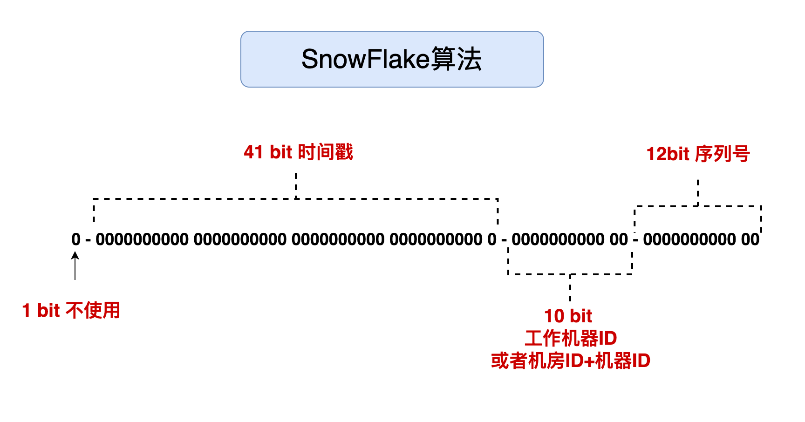
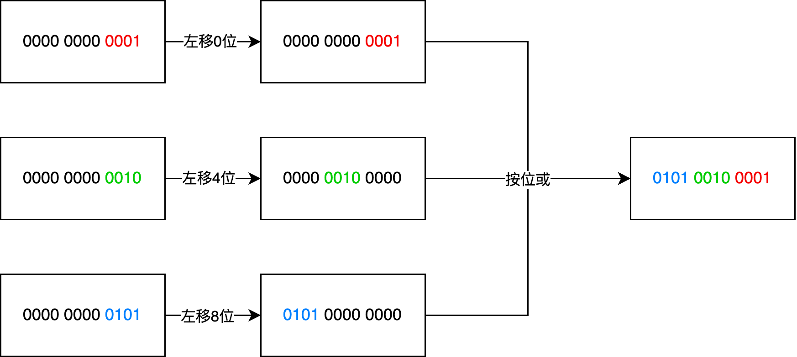

# SnowFlake算法

snowflake是Twitter开源的分布式ID生成算法，结果是一个long型的ID。

其核心思想是：使用41bit作为毫秒数，10bit作为机器的ID（5个bit是数据中心，5个bit的机器ID），12bit作为毫秒内的流水号（意味着每个节点在每毫秒可以产生 4096 个 ID），最后还有一个符号位，永远是0。

## 具体介绍

雪花算法是 64 位 的二进制，一共包含了四部分：

- 1位是符号位，也就是最高位，始终是0，没有任何意义，因为要是唯一计算机二进制补码中就是负数，0才是正数。
- 41位是时间戳，具体到毫秒，41位的二进制可以使用69年，因为时间理论上永恒递增，所以根据这个排序是可以的。
- 10位是机器标识，可以全部用作机器ID，也可以用来标识机房ID + 机器ID，10位最多可以表示1024台机器。
- 12位是计数序列号，也就是同一台机器上同一时间，理论上还可以同时生成不同的ID，12位的序列号能够区分出4096个ID。



```java
package cn.ray.domain.support.ids;

import org.slf4j.Logger;
import org.slf4j.LoggerFactory;

/**
 * @author Ray
 * @date 2022/10/12 16:18
 * @description 雪花算法生成随机ID
 */

public class SnowFlake {

    private Logger logger = LoggerFactory.getLogger(SnowFlake.class);

    /**
     * 数据中心(机房)ID
     */
    private long dataCenterId;
    /**
     * 机器ID
     */
    private long workerId;
    /**
     * 同一时间的序列号
     */
    private long sequence;

    /**
     * 开始时间戳:2020-05-20 08:00:00 +0800 CST
     */
    private final long twepoch = 1589923200000L;
    /**
     * 机房ID所占位数 5bit 最大:11111(二进制)-->31(十进制)
     */
    private final long dataCenterIdBits = 5L;
    /**
     * 机器ID所占位数 5bit 最大:11111(二进制)-->31(十进制)
     */
    private final long workerIdBits = 5L;
    /**
     * 同一时间的序列号所占位数 12bit 最大:111111111111(二进制)-->4095(十进制)
     */
    private final long sequenceBits = 12L;
    /**
     * 5 bit最多只能有31个数字，即机房id数量最多只能是32以内
     */
    private final long maxDataCenterId = -1L ^ (-1L << dataCenterIdBits);
    /**
     * 5 bit最多只能有31个数字，即机器id数量最多只能是32以内
     */
    private final long maxWorkerId = -1L ^ (-1L << workerIdBits);
    /**
     * 序列号掩码(0b111111111111==>0xfff==>4096)
     */
    private final long sequenceMask = -1L ^ (-1L << sequenceBits);
    /**
     * 机器ID偏移量
     */
    private final long workerIdShift = sequenceBits;
    /**
     * 机房ID偏移量
     */
    private final long dataCenterIdShift = workerIdBits + sequenceBits;
    /**
     * 时间戳偏移量
     */
    private final long timestampLeftShift = dataCenterIdBits + workerIdBits + sequenceBits;
    /**
     * 最近一次时间戳
     */
    private long lastTimestamp = -1L;

    public SnowFlake(long dataCenterId, long workerId) {
        this(dataCenterId,workerId,0);
    }

    public SnowFlake(long dataCenterId, long workerId, long sequence) {
        if ( dataCenterId>maxDataCenterId || dataCenterId < 0) {
            throw new IllegalArgumentException(String.format("机房ID 大于最大值 %d 或者 小于 0",maxDataCenterId));
        }
        if ( workerId>maxWorkerId || workerId < 0) {
            throw new IllegalArgumentException(String.format("机器ID 大于最大值 %d 或者 小于 0",maxWorkerId));
        }
        logger.info("机器启动中: 时间戳偏移量:{},机房ID占位:{},机器ID占位:{},序列号占位:{},机器ID:{}",
                timestampLeftShift,dataCenterIdBits,workerIdBits,sequenceBits,workerId);
        this.dataCenterId = dataCenterId;
        this.workerId = workerId;
        this.sequence = sequence;
    }

    /**
     * 获取机房ID
     * @return 机房ID
     */
    public long getDataCenterId() {
        return dataCenterId;
    }

    /**
     * 获取机器ID
     * @return 机器ID
     */
    public long getWorkerId() {
        return workerId;
    }

    /**
     * 获取最新的时间戳
     * @return 上一次生成ID的时间戳
     */
    public long getLastTimestamp() {
        return lastTimestamp;
    }

    /**
     * 获取下一个随机ID
     * @return 随机ID
     */
    public synchronized long nextId(){
        long currentTimestamp = System.currentTimeMillis();

        if (currentTimestamp < lastTimestamp) {
            logger.error("时间回退,最新时间戳:{}",lastTimestamp);
            throw new RuntimeException(String.format("时间回退,拒绝生成ID,实际相差: %d",lastTimestamp - currentTimestamp));
        }

        // 去重
        if (currentTimestamp == lastTimestamp) {
            sequence = (sequenceMask+1) & sequenceMask;

            // 如果 sequence 序列号 大于 4095
            if(sequence == 0) {
                currentTimestamp = nextTimestamp(lastTimestamp);
            }
        } else {
            // 如果是当前时间第一次生成ID,就初始化为0
            sequence = 0;
        }

        // 记录最新时间戳
        lastTimestamp = currentTimestamp;

        // 偏移计算生成随机ID
        return ((currentTimestamp - twepoch) << timestampLeftShift) |
                (dataCenterId << dataCenterIdShift) |
                (workerId << workerIdShift) |
                sequence;
    }

    private long nextTimestamp(long lastTimestamp) {
        long currentTimestamp = System.currentTimeMillis();

        // 如果当前时间戳小于等于 序列号已经超过4095 那个时间戳
        // 继续获取最新时间戳
        if (currentTimestamp <= lastTimestamp) {
            currentTimestamp = System.currentTimeMillis();
        }

        return currentTimestamp;
    }
}
```



- 最后将三部分(时间戳、机器ID、序列号)按照偏移量进行移位操作，然后按位或将其组合即可得到随机生成的唯一ID

## 优化

- 由于41位是时间戳，我们的时间计算是从1970年开始的，只能使用69年，为了不浪费，其实我们可以用时间的相对值，也就是以项目开始的时间为基准时间，往后可以使用69年。获取唯一ID的服务，对处理速度要求比较高，所以我们全部使用位运算以及位移操作，获取当前时间可以使用`System.currentTimeMillis()`。

- ### 时间回拨问题

  在获取时间的时候，可能会出现`时间回拨`的问题，时间回拨其实就是服务器上的时间突然倒退到之前的时间。

  1. 人为原因，把系统环境的时间改了。
  2. 有时候不同的机器上需要同步时间，可能不同机器之间存在误差，那么可能会出现时间回拨问题。

  **解决方案**

  1. 回拨时间小的时候，不生成 ID，循环等待到时间点到达。
  2. 上面的方案只适合时钟回拨较小的，如果间隔过大，阻塞等待，肯定是不可取的，因此要么超过一定大小的回拨直接报错，拒绝服务，或者有一种方案是利用拓展位，回拨之后在拓展位上加1就可以了，这样ID依然可以保持唯一。但是这个要求我们提前预留出位数，要么从机器id中，要么从序列号中，腾出一定的位，在时间回拨的时候，这个位置 `+1`。

## 相关问题

### 1. 第一位为什么不使用?

在计算机的表示中，第一位是符号位，0表示整数，第一位如果是1则表示负数，我们用的ID默认就是正数，所以默认就是0，那么这一位默认就没有意义。

### 2.机器位怎么用？

机器位或者机房位，一共10 bit，如果全部表示机器，那么可以表示1024台机器，如果拆分，5 bit 表示机房，5bit表示机房里面的机器，那么可以有32个机房，每个机房可以用32台机器。

### 3. twepoch表示什么？

由于时间戳只能用69年，我们的计时又是从1970年开始的，所以这个`twepoch`表示从项目开始的时间，用生成ID的时间减去`twepoch`作为时间戳，可以使用更久。

### 4. -1L ^ (-1L << x) 表示什么？

表示 x 位二进制可以表示多少个数值，假设x为3：

在计算机中，第一位是符号位，负数的反码是除了符号位，1变0，0变1, 而补码则是反码+1：

```
-1L 原码：1000 0001
-1L 反码：1111 1110
-1L 补码：1111 1111
```

从上面的结果可以知道，**-1L其实在二进制里面其实就是全部为1**,那么 -1L 左移动 3位，其实得到 `1111 1000`，也就是最后3位是0，再与`-1L`异或计算之后，其实得到的，就是后面3位全是1。

`-1L ^ (-1L << x) `表示的其实就是x位全是1的值，也就是x位的二进制能表示的最大数值。

### 5.时间戳比较

在获取时间戳小于上一次获取的时间戳的时候，不能生成ID，而是继续循环，直到生成可用的ID，这里没有使用拓展位防止时钟回拨。

### 6.前端直接使用发生精度丢失

如果前端直接使用服务端生成的 long 类型 id，会发生精度丢失的问题，因为 JS 中Number是16位的（指的是十进制的数字），而雪花算法计算出来最长的数字是19位的，这个时候需要用 String 作为中间转换，输出到前端即可。