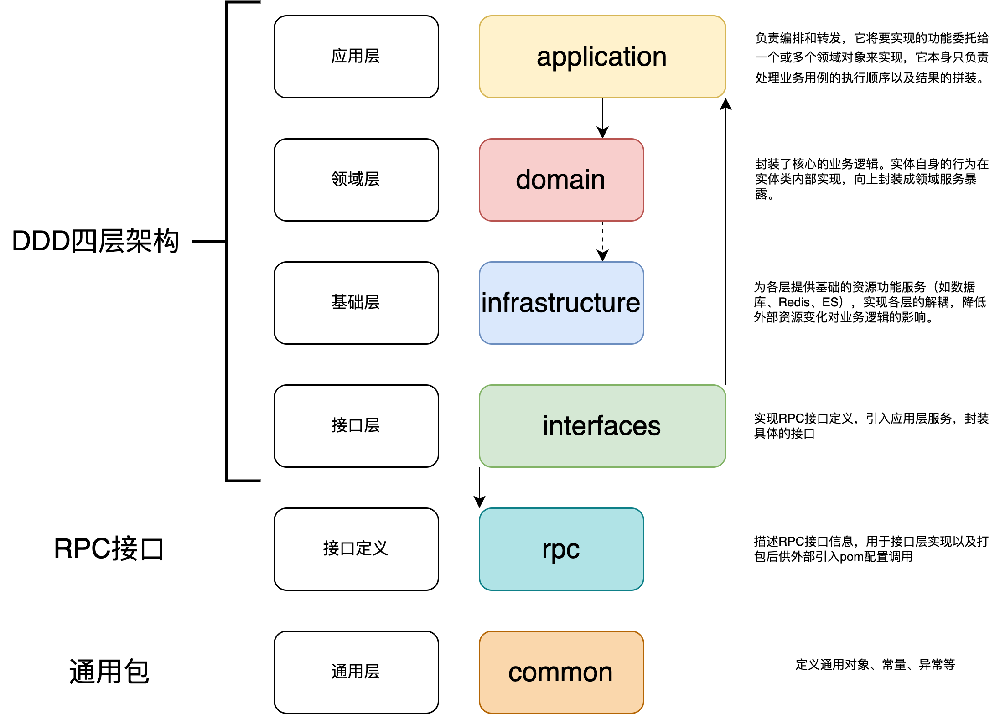

# 搭建（DDD+RPC）架构

## 简单了解DDD

在MVC三层架构中，我们进行功能开发之前，拿到需求，解读需求后，往往最先做的一步就是先设计表结构，在逐层设计上层dao，service，controller。对于需求都做了一层自我理解的转化。尤其在数据库结构这一层转化后，将业务主观的进行了抽象和转化。一旦业务边界划分模糊，考虑不全，就会造成后期的维护异常困难。

DDD要做的就是：

1. 消除信息不对称
2. 对MVC三层架构中自底向上的设计方式做反转，以业务为核心，自顶向下进行业务领域划分
3. 将大的业务需求进行拆分，分而治之

举个例子：电商订单场景

MVC：在分析好业务需求之后，就开始设计表结构了，订单表，支付表，商品表等等。然后编写业务逻辑。这是第一版的需求，之后需求增加了，订单支付后可以取消，下单的商品可以退换货，又需要进行加表，紧跟着对于的实现逻辑也进行修改。功能不断迭代，代码就不断的层层往上叠。

DDD：先划分业务边界。核心是订单。那么订单就是这个业务领域里面的聚合逻辑体现。支付，商品信息，地址等等都是围绕着订单而且。订单本身的属性决定之后，类似于地址，只是一个属性的体现。当你将订单的领域模型构建好之后，后续的逻辑边界与仓储设计也就随之而来了。

## 基于DDD架构四层架构，初始化搭建工程结构

所有的服务实现都以领域为核心，应用层定义接口，领域层实现接口，领域层定义数据仓储，基础层实现数据仓储相关操作，但同时几个模块相互依赖，存在低耦合。这个时候引入 RPC 框架，需要对外提供描述接口信息让外部调用方引入才可以通过反射调用到具体的方法提供者。

解决模块间循环依赖以及RPC接口调用：

1. 经典加一层：由 RPC 层定义接口描述，供接口层使用以及外部调用方使用。
2. 应用层不再给领域层定义接口，而是自行处理对领域层接口的包装。否则领域层既引入了应用层的Jar，应用层调用领域服务时也引入了领域层的Jar，就会出现循环依赖的问题。
3. 同理，基础层中的数据仓储的定义也需要从领域层剥离，否则也会出现循环依赖的问题。