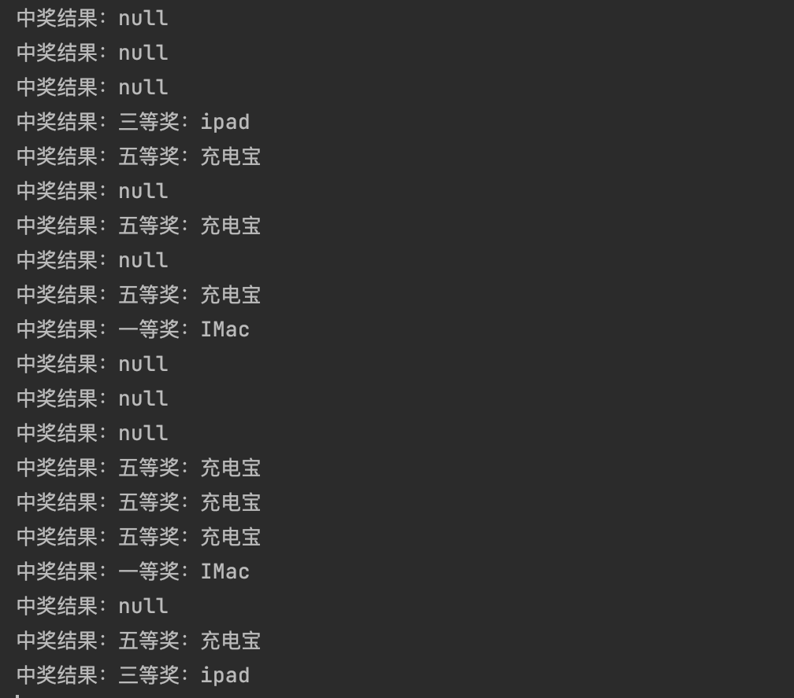

# 抽奖策略领域模块开发


Tips：当前只有使用 单项概率 策略时才会初始化概率元祖，而奖品概率信息是在初始化时才会被存放到内存中，即使用 总体概率 策略时 会报 `awardRateInfoMap` 空指针异常

**ApiTest**

```java
package cn.ray.test;

import cn.ray.domain.strategy.model.vo.AwardRateInfo;
import cn.ray.domain.strategy.service.algorithm.IDrawAlgorithm;
import org.junit.Before;
import org.junit.Test;
import org.junit.runner.RunWith;
import org.springframework.boot.test.context.SpringBootTest;
import org.springframework.test.context.junit4.SpringRunner;

import javax.annotation.Resource;
import java.math.BigDecimal;
import java.util.ArrayList;
import java.util.List;

/**
 * @author JOJO
 * @date 2022/10/3 00:47
 * 抽奖策略测试
 */
@RunWith(SpringRunner.class)
@SpringBootTest
public class DrawAlgorithm {

    //    @Resource(name = "defaultRateRandomDrawAlgorithm")
    @Resource(name = "singleRateRandomDrawAlgorithm")
    private IDrawAlgorithm randomDrawAlgorithm;

    @Before
    public void init() {
        // 奖品信息
        List<AwardRateInfo> strategyList = new ArrayList<>();
        strategyList.add(new AwardRateInfo("一等奖：IMac", new BigDecimal("0.05")));
        strategyList.add(new AwardRateInfo("二等奖：iphone", new BigDecimal("0.15")));
        strategyList.add(new AwardRateInfo("三等奖：ipad", new BigDecimal("0.20")));
        strategyList.add(new AwardRateInfo("四等奖：AirPods", new BigDecimal("0.25")));
        strategyList.add(new AwardRateInfo("五等奖：充电宝", new BigDecimal("0.35")));

        // 初始数据
        randomDrawAlgorithm.initRateTuple(100001L, strategyList);
    }

    @Test
    public void test_randomDrawAlgorithm() {

        List<String> excludeAwardIds = new ArrayList<>();
        excludeAwardIds.add("二等奖：iphone");
        excludeAwardIds.add("四等奖：AirPods");

        for (int i = 0; i < 20; i++) {
            System.out.println("中奖结果：" + randomDrawAlgorithm.randomDraw(100001L, excludeAwardIds));
        }

    }

}
```


