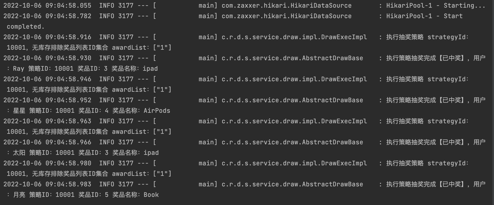

# 模板模式处理抽奖流程

1. 模板模式

   - 通过在抽象类中定义模板方法，并提供一系列抽象方法供继承方实现，外部继承方只需关心具体的业务逻辑实现。
   - 在模板方法中对抽象方法进行一系列的编排，定义一个标准的执行流程。


## ApiTest

```java
@Test
public void test_drawExec() {
  drawExec.doDrawExec(new DrawReq("Ray", 10001L));
  drawExec.doDrawExec(new DrawReq("星星", 10001L));
  drawExec.doDrawExec(new DrawReq("太阳", 10001L));
  drawExec.doDrawExec(new DrawReq("月亮", 10001L));
}
```



