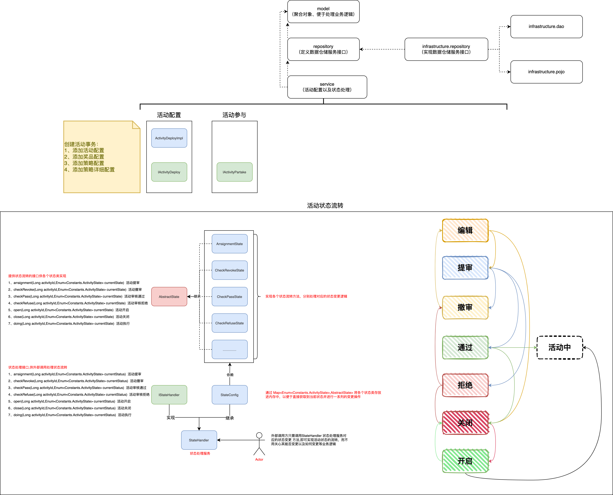
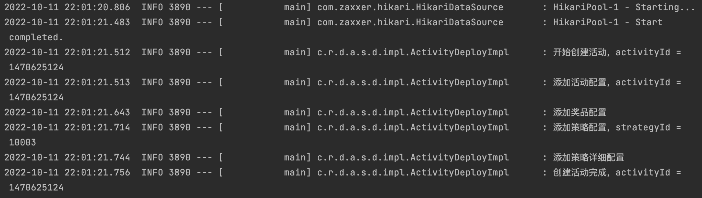

# 活动领域的配置以及状态处理

## 包引用调整


1. 由于领域层 domain 不再引用基础层 infrastructure ，故 无法使用 cn.ray.infrastructure.pojo 层下的对象，需要自定义 所需的 Vo对象类

2. 领域层 domain 无法使用 cn.ray.infrastructure.dao ，对数据进行一系列操作，所以 由 领域层 定义数据仓储服务接口， 而 基础层 infrastructure 调用包内的 dao 对象 实现其接口完成对数据的一系列CURD操作以及数据的包装返回

   ```java
   BeanUtils.copyProperties(award, awardBriefVO);
   // BeanUtils.copyProperties(A, B);
   // 将 A 与 B 同名的属性，由 A 赋值 给 B
   
   // 但在效率上最好的依旧是硬编码
   AwardBriefVo awardBriefVO = new AwardBriefVo();
   awardBriefVO.setAwardId(award.getAwardId());
   awardBriefVO.setAwardType(award.getAwardType());
   awardBriefVO.setAwardName(award.getAwardName());
   awardBriefVO.setAwardContent(award.getAwardContent());
   ```


## 活动配置

活动的创建操作主要包括：添加活动配置、添加奖品配置、添加策略配置、添加策略明细配置，这些都是在同一个注解事务配置下进行处理 `@Transactional(rollbackFor = Exception.class)`

另外，奖品配置和策略配置都是集合形式的，这里使用了 Mybatis 的一次插入多条数据配置：


```java
public void addAward(List<AwardVo> awardList) {
  List<Award> req = new ArrayList<>();
  for (AwardVo awardVo : awardList) {
  Award award = new Award();
  BeanUtils.copyProperties(awardVo,award);
  req.add(award);
  }
  awardDao.insertList(req);
}
```


```xml
<insert id="insertList" parameterType="java.util.List">
        INSERT INTO award(award_id, award_type, award_name, award_content, create_time, update_time)
        VALUES
        <foreach collection="list" item="item" index="index" separator=",">
            (
            #{item.awardId},
            #{item.awardType},
            #{item.awardName},
            #{item.awardContent},
            NOW(),
            NOW()
            )
        </foreach>
</insert>
```





## ApiTest

### 活动创建

```java
@Before
public void init() {

        ActivityVo activity = new ActivityVo();
        activity.setActivityId(activityId);
        activity.setActivityName("测试活动");
        activity.setActivityDesc("测试活动描述");
        activity.setBeginDateTime(new Date());
        activity.setEndDateTime(new Date());
        activity.setStockCount(100);
        activity.setTakeCount(10);
        activity.setState(Constants.ActivityState.EDIT.getCode());
        activity.setCreator("Ray");

        StrategyVo strategy = new StrategyVo();
        strategy.setStrategyId(10003L);
        strategy.setStrategyDesc("抽奖策略");
        strategy.setStrategyMode(Constants.StrategyMode.SINGLE.getCode());
        strategy.setGrantType(1);
        strategy.setGrantDate(new Date());
        strategy.setExtInfo("");

        StrategyDetailVo strategyDetail_01 = new StrategyDetailVo();
        strategyDetail_01.setStrategyId(strategy.getStrategyId());
        strategyDetail_01.setAwardId("106");
        strategyDetail_01.setAwardName("一等奖");
        strategyDetail_01.setAwardCount(10);
        strategyDetail_01.setAwardSurplusCount(10);
        strategyDetail_01.setAwardRate(new BigDecimal("0.05"));

        StrategyDetailVo strategyDetail_02 = new StrategyDetailVo();
        strategyDetail_02.setStrategyId(strategy.getStrategyId());
        strategyDetail_02.setAwardId("107");
        strategyDetail_02.setAwardName("二等奖");
        strategyDetail_02.setAwardCount(20);
        strategyDetail_02.setAwardSurplusCount(20);
        strategyDetail_02.setAwardRate(new BigDecimal("0.15"));

        StrategyDetailVo strategyDetail_03 = new StrategyDetailVo();
        strategyDetail_03.setStrategyId(strategy.getStrategyId());
        strategyDetail_03.setAwardId("108");
        strategyDetail_03.setAwardName("三等奖");
        strategyDetail_03.setAwardCount(50);
        strategyDetail_03.setAwardSurplusCount(50);
        strategyDetail_03.setAwardRate(new BigDecimal("0.20"));

        StrategyDetailVo strategyDetail_04 = new StrategyDetailVo();
        strategyDetail_04.setStrategyId(strategy.getStrategyId());
        strategyDetail_04.setAwardId("109");
        strategyDetail_04.setAwardName("四等奖");
        strategyDetail_04.setAwardCount(100);
        strategyDetail_04.setAwardSurplusCount(100);
        strategyDetail_04.setAwardRate(new BigDecimal("0.25"));

        StrategyDetailVo strategyDetail_05 = new StrategyDetailVo();
        strategyDetail_05.setStrategyId(strategy.getStrategyId());
        strategyDetail_05.setAwardId("110");
        strategyDetail_05.setAwardName("五等奖");
        strategyDetail_05.setAwardCount(500);
        strategyDetail_05.setAwardSurplusCount(500);
        strategyDetail_05.setAwardRate(new BigDecimal("0.35"));

        List<StrategyDetailVo> strategyDetailList = new ArrayList<>();
        strategyDetailList.add(strategyDetail_01);
        strategyDetailList.add(strategyDetail_02);
        strategyDetailList.add(strategyDetail_03);
        strategyDetailList.add(strategyDetail_04);
        strategyDetailList.add(strategyDetail_05);

        strategy.setStrategyDetailList(strategyDetailList);

        AwardVo award_01 = new AwardVo();
        award_01.setAwardId("106");
        award_01.setAwardType(Constants.AwardType.DESCGOODS.getCode());
        award_01.setAwardName("电脑");
        award_01.setAwardContent("请联系活动组织者 ray");

        AwardVo award_02 = new AwardVo();
        award_02.setAwardId("107");
        award_02.setAwardType(Constants.AwardType.DESCGOODS.getCode());
        award_02.setAwardName("手机");
        award_02.setAwardContent("请联系活动组织者 ray");

        AwardVo award_03 = new AwardVo();
        award_03.setAwardId("108");
        award_03.setAwardType(Constants.AwardType.DESCGOODS.getCode());
        award_03.setAwardName("平板");
        award_03.setAwardContent("请联系活动组织者 ray");

        AwardVo award_04 = new AwardVo();
        award_04.setAwardId("109");
        award_04.setAwardType(Constants.AwardType.DESCGOODS.getCode());
        award_04.setAwardName("耳机");
        award_04.setAwardContent("请联系活动组织者 ray");

        AwardVo award_05 = new AwardVo();
        award_05.setAwardId("110");
        award_05.setAwardType(Constants.AwardType.DESCGOODS.getCode());
        award_05.setAwardName("数据线");
        award_05.setAwardContent("请联系活动组织者 ray");

        List<AwardVo> awardList = new ArrayList<>();
        awardList.add(award_01);
        awardList.add(award_02);
        awardList.add(award_03);
        awardList.add(award_04);
        awardList.add(award_05);

        activityConfigRich = new ActivityConfigRich(activity,awardList,strategy);
}

@Test
public void test_createActivity() {
        activityDeploy.createActivity(new ActivityConfigReq(activityId, activityConfigRich));
}
```



### 状态流转

```java
@Test
public void test_alterState() {
        logger.info("提交审核，测试：{}", JSON.toJSONString(stateHandler.arraignment(activityId, Constants.ActivityState.EDIT)));
        logger.info("审核通过，测试：{}", JSON.toJSONString(stateHandler.checkPass(activityId, Constants.ActivityState.ARRAIGNMENT)));
        logger.info("运行活动，测试：{}", JSON.toJSONString(stateHandler.doing(activityId, Constants.ActivityState.PASS)));
        logger.info("二次提审，测试：{}", JSON.toJSONString(stateHandler.checkPass(activityId, Constants.ActivityState.DOING)));
}
```

