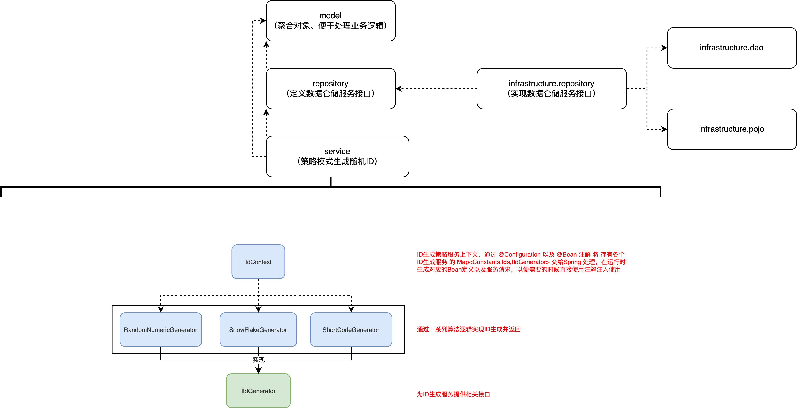

# 支撑领域—ID生成策略领域

使用策略模式把三种生成ID的算法进行统一包装，由调用方决定使用哪种生成ID的策略。

雪花算法本章节使用的是自己码的一个普通算法：[雪花算法](https://github.com/L-XRay/Notes/blob/main/%E5%BE%85%E5%88%86%E7%B1%BB/%E9%9B%AA%E8%8A%B1%E7%AE%97%E6%B3%95.md)

一般在实际使用雪花算法时需要做一些优化处理，比如支持时间回拨、支持手工插入、简短生成长度、提升生成速度等。后期可能会自己做一些优化或者直接替换成工具包 hutool 包装好的工具类。

而日期拼接和随机数工具包生成方式，都需要自己保证唯一性，一般使用此方式生成的ID，都用在单表中，本身可以在数据库配置唯一ID。

*不用自增ID的原因，是因为自增ID通常容易被外界知晓你的运营数据，以及后续需要做数据迁移到分库分表中都会有些麻烦*

关于 ID 的生成因为有三种不同 ID 用于在不同的场景下；

- 订单号：唯一、大量、订单创建时使用、分库分表｜采用雪花算法
- 活动号：唯一、少量、活动创建时使用、单库单表｜采用日期拼接
- 策略号：唯一、少量、活动创建时使用、单库单表｜采用随机数



## ApiTest

```java
package cn.ray.test.domain;

import cn.ray.common.Constants;
import cn.ray.domain.support.ids.IIdGenerator;
import org.junit.Test;
import org.junit.runner.RunWith;
import org.slf4j.Logger;
import org.slf4j.LoggerFactory;
import org.springframework.boot.test.context.SpringBootTest;
import org.springframework.test.context.junit4.SpringRunner;

import javax.annotation.Resource;
import java.util.Map;

/**
 * @author Ray
 * @date 2022/10/12 20:59
 * @description 支撑领域测试
 */
@RunWith(SpringRunner.class)
@SpringBootTest
public class SupportTest {

    private Logger logger = LoggerFactory.getLogger(SupportTest.class);

    @Resource
    private Map<Constants.Ids, IIdGenerator> idGeneratorMap;

    @Test
    public void test_ids() {
        logger.info("雪花算法策略，生成ID：{}", idGeneratorMap.get(Constants.Ids.SnowFlake).nextId());
        logger.info("日期算法策略，生成ID：{}", idGeneratorMap.get(Constants.Ids.ShortCode).nextId());
        logger.info("随机算法策略，生成ID：{}", idGeneratorMap.get(Constants.Ids.RandomNumeric).nextId());
    }

}
```

