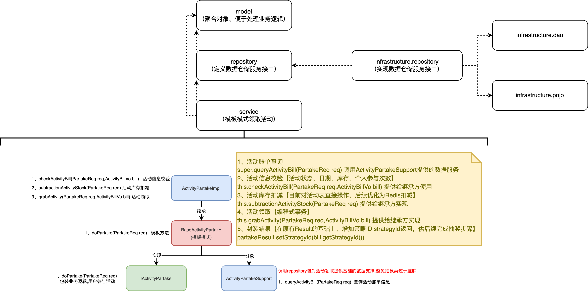
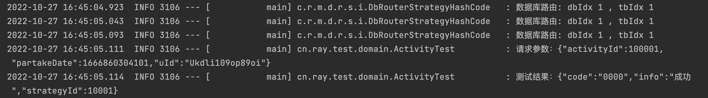
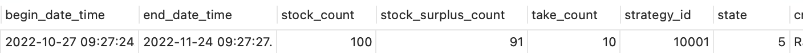
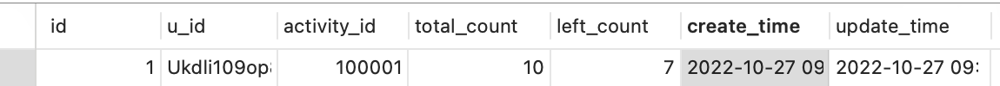
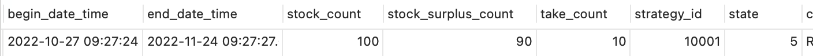
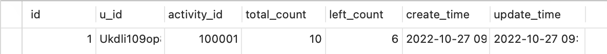
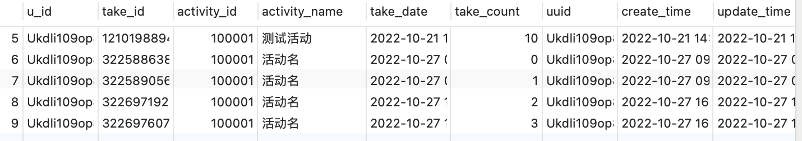

# 声明事务领取活动领域开发



## 领取活动编程式事务处理

```java
@Override
protected Result grabActivity(PartakeReq req, ActivityBillVo bill) {
        try {
            dbRouterStrategy.dbRouter(req.getuId());
            return transactionTemplate.execute(status -> {
                try {
                    // 扣减个人已参与次数
                    int updateCount = userTakeActivityRepository.subtractionLeftCount(req.getuId(), req.getActivityId(), bill.getActivityName(), bill.getTakeCount(), bill.getUserTakeLeftCount(),req.getPartakeDate());
                    if (0 == updateCount) {
                        status.setRollbackOnly();
                        logger.error("领取活动,扣减个人已参与次数失败,activityId:{},uId:{}",req.getActivityId(),req.getuId());
                        return Result.buildResult(Constants.ResponseCode.NO_UPDATE);
                    }

                    // 插入领取活动信息
                    long takeId = idGenerator.get(Constants.Ids.SnowFlake).nextId();
                    userTakeActivityRepository.takeActivity(req.getuId(),takeId, req.getActivityId(), bill.getActivityName(), req.getPartakeDate(), bill.getTakeCount(), bill.getUserTakeLeftCount());
                } catch (DuplicateKeyException e) {
                    status.setRollbackOnly();
                    logger.error("领取活动,唯一索引冲突,activityId:{},uId:{}",req.getActivityId(),req.getuId());
                    return Result.buildResult(Constants.ResponseCode.INDEX_DUP);
                }
                return Result.buildSuccessResult();
            });
        } finally {
            dbRouterStrategy.clear();
        }
}
```

- dbRouter.doRouter(partake.getuId()); 是编程式处理分库分表，如果在不需要使用事务的场景下，直接使用注解配置到DAO方法上即可。**两个方式不能混用**
- transactionTemplate.execute 是编程式事务，用的是路由中间件提供的事务对象，通过这样的方式可以更加方便的处理细节的回滚，而不需要抛异常处理

## 测试

```java
@Test
public void test_activityPartake() {
        PartakeReq req = new PartakeReq("Ukdli109op89oi",100001L);
        PartakeResult res = activityPartake.doPartake(req);
        logger.info("请求参数：{}", JSON.toJSONString(req));
        logger.info("测试结果：{}", JSON.toJSONString(res));
}
```

### 测试结果



### Before

**activity**



**user_take_activity_count**




### After

**activity**



**user_take_activity_count**



**user_take_activity**



- 正常领取活动后，会在表 user_take_activity 有对应的领取记录
- 活动的状态、时间、库存、个人领取次数，有任何不满足时都会反馈相应的信息。