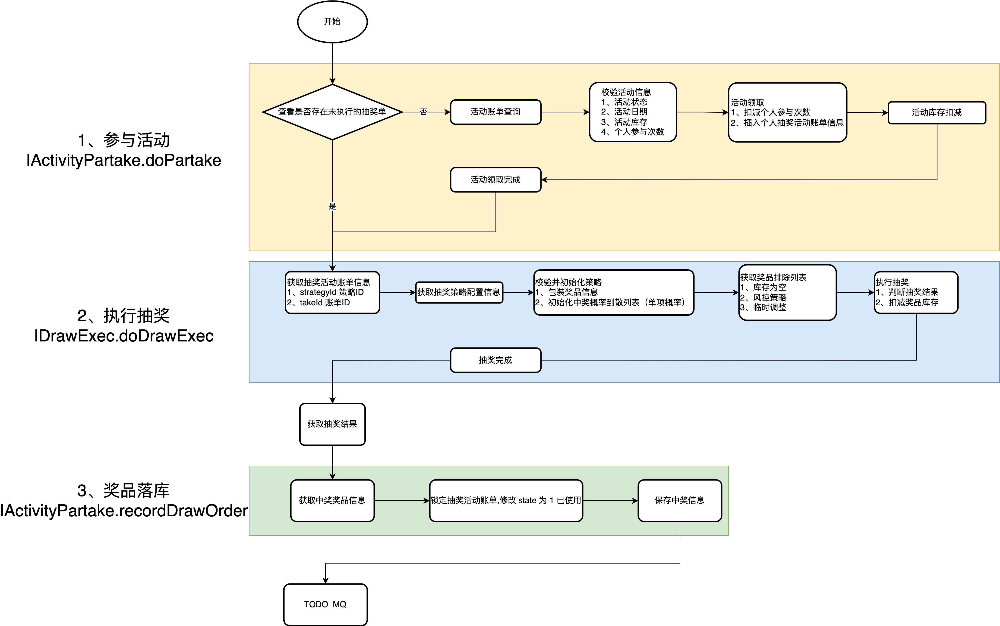
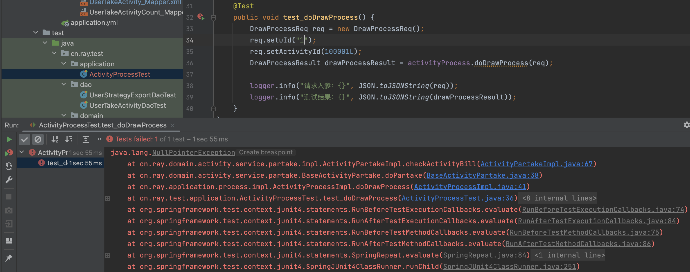
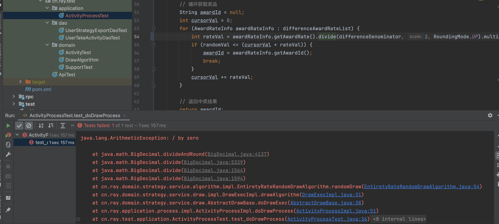
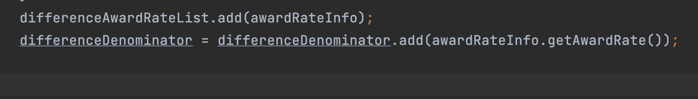
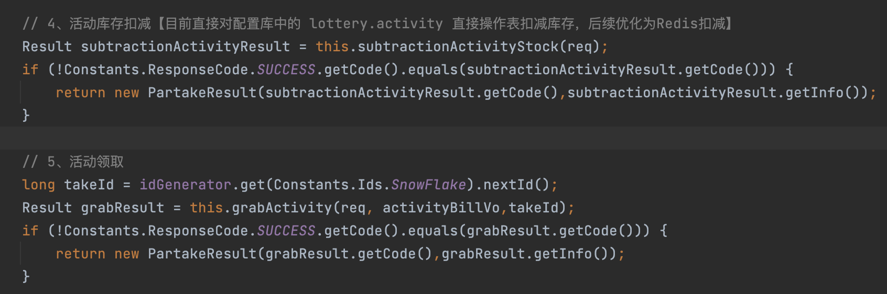
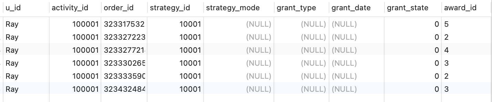
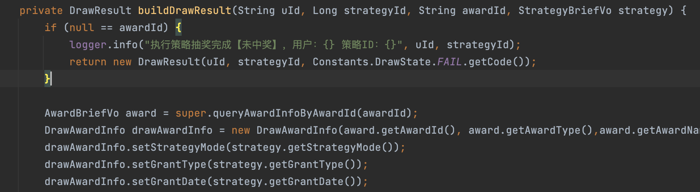

# 应用层编排抽奖流程

用户领取活动时候，新增 strategy_id、state 两个字段，这两个字段就是为了处理用户抽奖失败的抽奖活动单，state状态控制事务操作的幂等性

## 所遇到的问题

1、user_take_activity_count 表中没有指定用户的记录,获取不到参与次数，报空指针异常。后续需要添加相应的接口增加记录。

2、策略方式 strategy_mode 为 总体概率 2 时，发现是Bigdecimal 计算时除数为0，即differenceDenominator没有变化

搜索发现 Bigdecimal的add 方法 是对结果进行接收,而本身是不变的。改动如下：

3、先扣除活动库存，如果出现事务回滚, 会导致**活动领取失败，但活动库存依然扣减这种情况**出现

这里我直接把顺序对调，先领取活动，再去扣减库存，就不会出现上述情况。（但不知道会不会产生其他问题

4、奖品清单并不完整，需要在抽奖策略完成时完善包装中奖结果

## 结果

1、事务控制：通过 user_take_activity 加入 state 状态字段 ，在写入中奖信息到 user_strategy_export 表 时，与 user_take_activity 表做一个幂等性的事务,同时加入 strategy_id 策略ID字段，用于处理领取了活动单但执行抽奖失败时，可以继续获取到此抽奖单继续执行抽奖，而不需要重新领取活动。其实 user_take_activity 表就像是中间层，可以在控制幂等反复使用