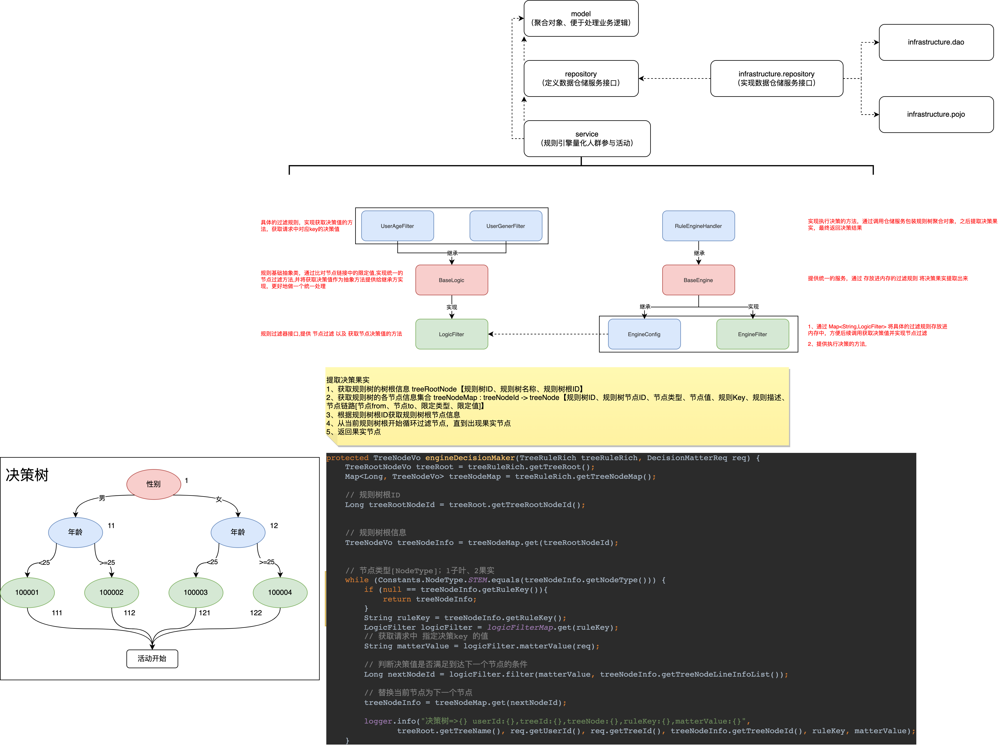
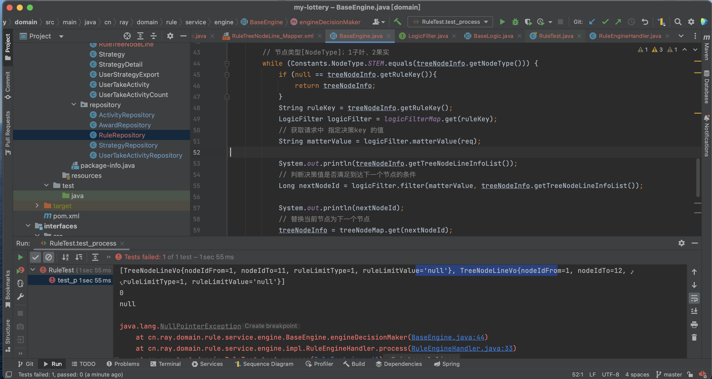
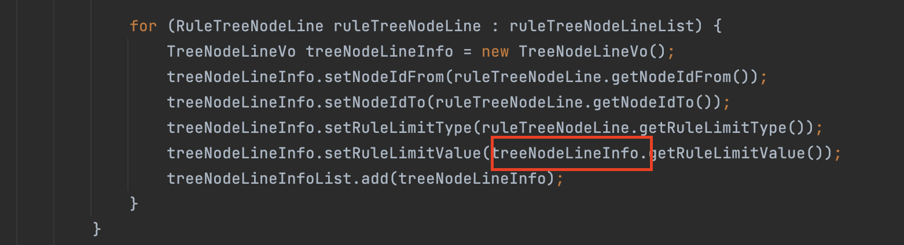
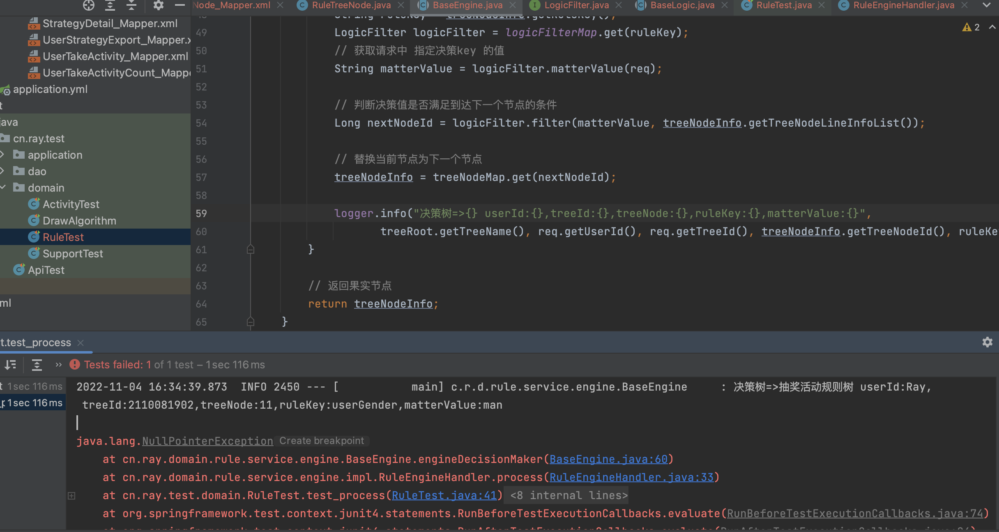

# 规则引擎量化人群参与活动

## 结果

1、测试过程中,判断决策值是否满足到达下一个节点的条件返回为0 ，导致进入下一节点失败 返回null , 经调试发现是粗心大意导致ruleLimitValue 未成功赋值。。。

2、待解决问题：

当请求不满足规则时即没有符合参加的活动（没有得到果实节点，中途停止）,就会产生以上判断决策值是否满足到达下一个节点的条件返回为0 ，导致进入下一节点失败 返回null 的问题

