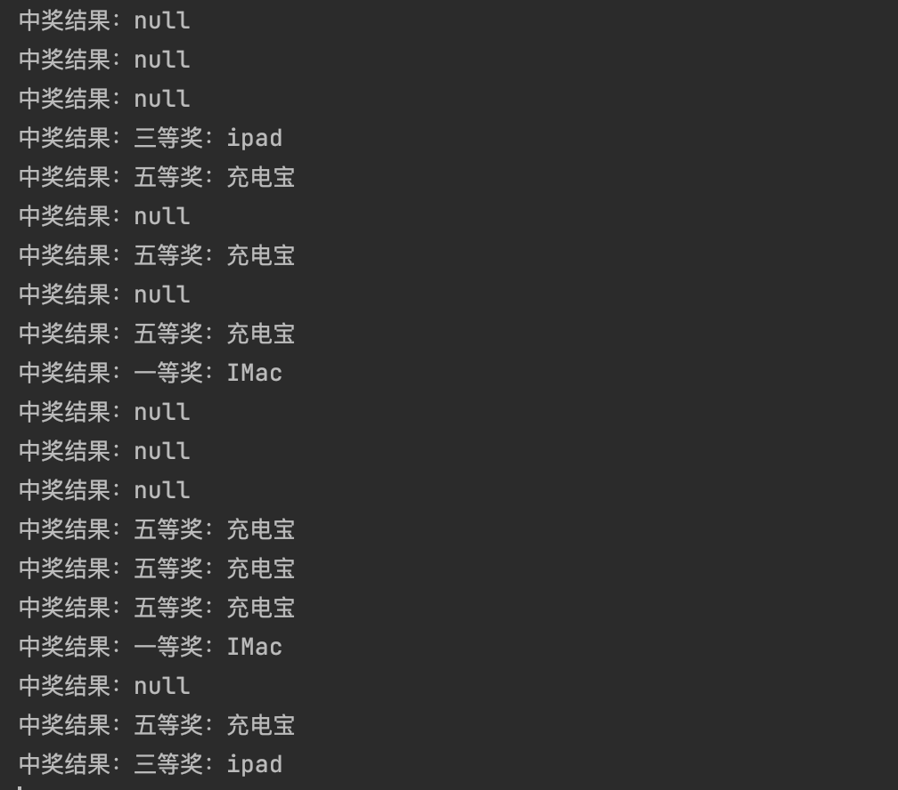
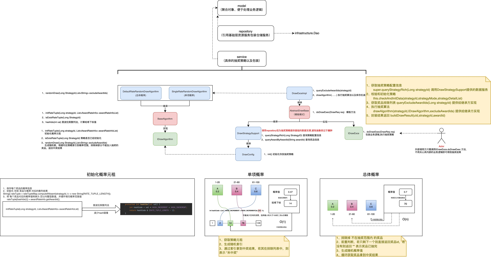
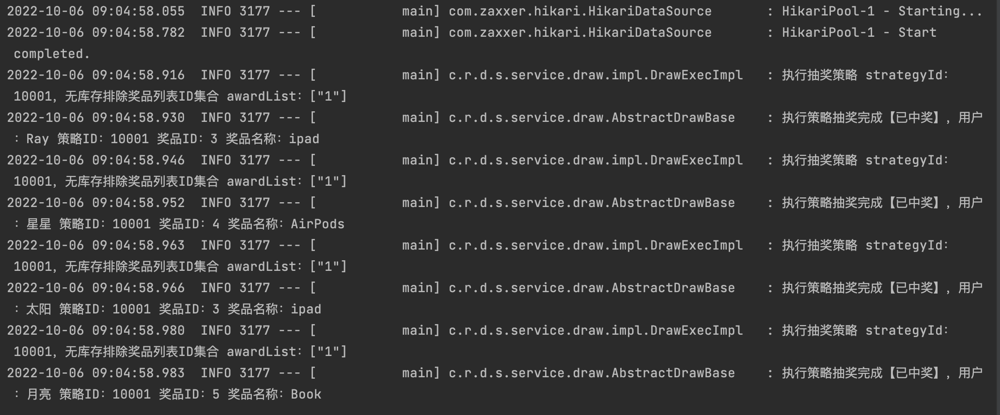
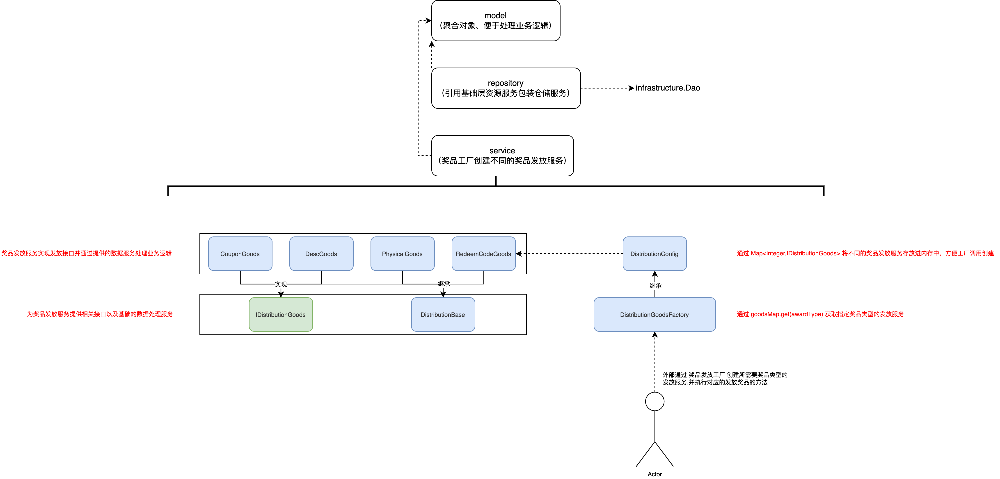
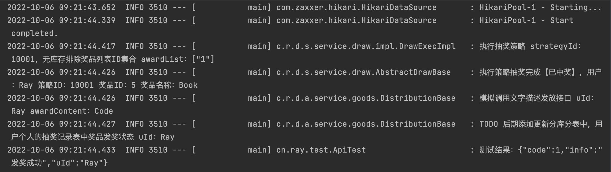
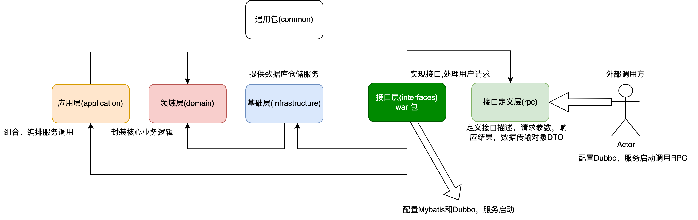
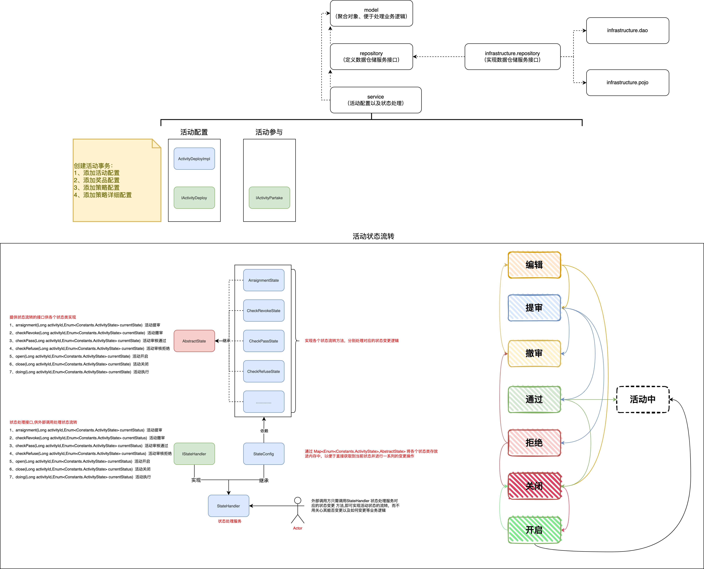
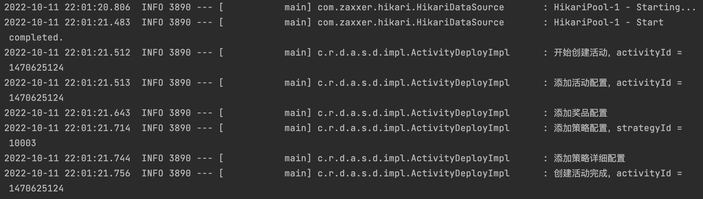
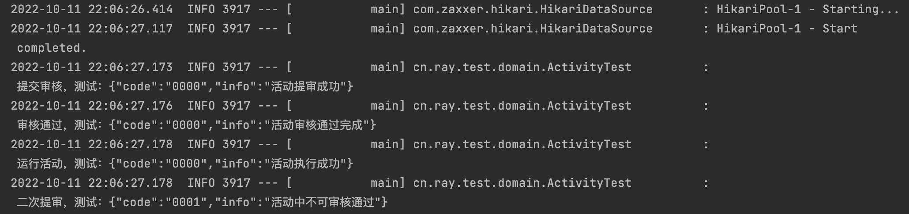

# 搭建（DDD+RPC）架构

## 简单了解DDD

在MVC三层架构中，我们进行功能开发之前，拿到需求，解读需求后，往往最先做的一步就是先设计表结构，在逐层设计上层dao，service，controller。对于需求都做了一层自我理解的转化。尤其在数据库结构这一层转化后，将业务主观的进行了抽象和转化。一旦业务边界划分模糊，考虑不全，就会造成后期的维护异常困难。

DDD要做的就是：

1. 消除信息不对称
2. 对MVC三层架构中自底向上的设计方式做反转，以业务为核心，自顶向下进行业务领域划分
3. 将大的业务需求进行拆分，分而治之

举个例子：电商订单场景

MVC：在分析好业务需求之后，就开始设计表结构了，订单表，支付表，商品表等等。然后编写业务逻辑。这是第一版的需求，之后需求增加了，订单支付后可以取消，下单的商品可以退换货，又需要进行加表，紧跟着对于的实现逻辑也进行修改。功能不断迭代，代码就不断的层层往上叠。

DDD：先划分业务边界。核心是订单。那么订单就是这个业务领域里面的聚合逻辑体现。支付，商品信息，地址等等都是围绕着订单而且。订单本身的属性决定之后，类似于地址，只是一个属性的体现。当你将订单的领域模型构建好之后，后续的逻辑边界与仓储设计也就随之而来了。

## 基于DDD架构四层架构，初始化搭建工程结构


所有的服务实现都以领域为核心，应用层定义接口，领域层实现接口，领域层定义数据仓储，基础层实现数据仓储相关操作，但同时几个模块相互依赖，存在低耦合。这个时候引入 RPC 框架，需要对外提供描述接口信息让外部调用方引入才可以通过反射调用到具体的方法提供者。

解决模块间循环依赖以及RPC接口调用：

1. 经典加一层：由 RPC 层定义接口描述，供接口层使用以及外部调用方使用。
2. 应用层不再给领域层定义接口，而是自行处理对领域层接口的包装。否则领域层既引入了应用层的Jar，应用层调用领域服务时也引入了领域层的Jar，就会出现循环依赖的问题。
3. 同理，基础层中的数据仓储的定义也需要从领域层剥离，否则也会出现循环依赖的问题。

# 构建工程完成RPC接口的实现和调用

## 模块分层

1. application，应用层，引用：`domain`
2. domain，领域层，引用：`infrastructure`
3. infrastructure，基础层，引用：`无`
4. interfaces，接口层，引用：`application`、`rpc`
5. rpc，RPC接口定义层，引用：`common`
6. common，通用包，引用：`无`

## 模块关系

1. 首先 rpc 层定义接口，供接口层实现以及外部调用。
2. 基础层 提供数据的仓储服务，供领域服务或微服务外的应用服务调用接口实现数据的持久化以及资源的直接访问，降低外部资源对业务逻辑的影响。
3. 领域层 主要封装核心的业务逻辑，供应用层调用接口实现编排、组合以及事件订阅发布等。
4. 接口层 实现 rpc 层的接口，调用应用层编排好的服务接口将用户的请求处理并返回给外部调用方。

ps：这里只简单测试调用 rpc ，因此这里 接口层直接引入基础层仓储服务进行测试。


# 库表设计


# 抽奖策略领域模块开发


Tips：当前只有使用 单项概率 策略时才会初始化概率元祖，而奖品概率信息是在初始化时才会被存放到内存中，即使用 总体概率 策略时 会报 `awardRateInfoMap` 空指针异常

## ApiTest

```java
package cn.ray.test;

import cn.ray.domain.strategy.model.vo.AwardRateInfo;
import cn.ray.domain.strategy.service.algorithm.IDrawAlgorithm;
import org.junit.Before;
import org.junit.Test;
import org.junit.runner.RunWith;
import org.springframework.boot.test.context.SpringBootTest;
import org.springframework.test.context.junit4.SpringRunner;

import javax.annotation.Resource;
import java.math.BigDecimal;
import java.util.ArrayList;
import java.util.List;

/**
 * @author JOJO
 * @date 2022/10/3 00:47
 * 抽奖策略测试
 */
@RunWith(SpringRunner.class)
@SpringBootTest
public class DrawAlgorithm {

    //    @Resource(name = "defaultRateRandomDrawAlgorithm")
    @Resource(name = "singleRateRandomDrawAlgorithm")
    private IDrawAlgorithm randomDrawAlgorithm;

    @Before
    public void init() {
        // 奖品信息
        List<AwardRateInfo> strategyList = new ArrayList<>();
        strategyList.add(new AwardRateInfo("一等奖：IMac", new BigDecimal("0.05")));
        strategyList.add(new AwardRateInfo("二等奖：iphone", new BigDecimal("0.15")));
        strategyList.add(new AwardRateInfo("三等奖：ipad", new BigDecimal("0.20")));
        strategyList.add(new AwardRateInfo("四等奖：AirPods", new BigDecimal("0.25")));
        strategyList.add(new AwardRateInfo("五等奖：充电宝", new BigDecimal("0.35")));

        // 初始数据
        randomDrawAlgorithm.initRateTuple(100001L, strategyList);
    }

    @Test
    public void test_randomDrawAlgorithm() {

        List<String> excludeAwardIds = new ArrayList<>();
        excludeAwardIds.add("二等奖：iphone");
        excludeAwardIds.add("四等奖：AirPods");

        for (int i = 0; i < 20; i++) {
            System.out.println("中奖结果：" + randomDrawAlgorithm.randomDraw(100001L, excludeAwardIds));
        }

    }

}
```



# 模板模式处理抽奖流程

1. 模板模式

   - 通过在抽象类中定义模板方法，并提供一系列抽象方法供继承方实现，外部继承方只需关心具体的业务逻辑实现。
   - 在模板方法中对抽象方法进行一系列的编排，定义一个标准的执行流程。



## ApiTest

```java
@Test
public void test_drawExec() {
  drawExec.doDrawExec(new DrawReq("Ray", 10001L));
  drawExec.doDrawExec(new DrawReq("星星", 10001L));
  drawExec.doDrawExec(new DrawReq("太阳", 10001L));
  drawExec.doDrawExec(new DrawReq("月亮", 10001L));
}
```



# 工厂方法模式搭建发奖领域



## ApiTest

```java
@Test
public void test_award() {
        // 执行抽奖
        DrawResult drawResult = drawExec.doDrawExec(new DrawReq("Ray", 10001L));

        // 判断抽奖结果
        Integer drawState = drawResult.getDrawState();
        if (Constants.DrawState.FAIL.getCode().equals(drawState)) {
            logger.info("未中奖 DrawAwardInfo is null");
            return;
        }

        // 封装发奖参数，orderId：2109313442431 为模拟ID，需要在用户参与领奖活动时生成
        DrawAwardInfo drawAwardInfo = drawResult.getDrawAwardInfo();
        GoodsReq goodsReq = new GoodsReq(drawResult.getuId(), "2109313442431", drawAwardInfo.getAwardId(), drawAwardInfo.getAwardName(), drawAwardInfo.getAwardContent());

        // 根据 awardType 从抽奖工厂中获取对应的发奖服务
        IDistributionGoods distributionGoodsService = distributionGoodsFactory.getDistributionGoodsService(drawAwardInfo.getAwardType());
        DistributionRes distributionRes = distributionGoodsService.doDistribution(goodsReq);

        logger.info("测试结果：{}", JSON.toJSONString(distributionRes));
}
```



# 活动领域的配置以及状态处理

## 包引用调整



1. 由于领域层 domain 不再引用基础层 infrastructure ，故 无法使用 cn.ray.infrastructure.pojo 层下的对象，需要自定义 所需的 Vo对象类

2. 领域层 domain 无法使用 cn.ray.infrastructure.dao ，对数据进行一系列操作，所以 由 领域层 定义数据仓储服务接口， 而 基础层 infrastructure 调用包内的 dao 对象 实现其接口完成对数据的一系列CURD操作以及数据的包装返回

   ```java
   BeanUtils.copyProperties(award, awardBriefVO);
   // BeanUtils.copyProperties(A, B);
   // 将 A 与 B 同名的属性，由 A 赋值 给 B
   
   // 但在效率上最好的依旧是硬编码
   AwardBriefVo awardBriefVO = new AwardBriefVo();
   awardBriefVO.setAwardId(award.getAwardId());
   awardBriefVO.setAwardType(award.getAwardType());
   awardBriefVO.setAwardName(award.getAwardName());
   awardBriefVO.setAwardContent(award.getAwardContent());
   ```

## 活动配置

活动的创建操作主要包括：添加活动配置、添加奖品配置、添加策略配置、添加策略明细配置，这些都是在同一个注解事务配置下进行处理 `@Transactional(rollbackFor = Exception.class)`

另外，奖品配置和策略配置都是集合形式的，这里使用了 Mybatis 的一次插入多条数据配置：


```java
public void addAward(List<AwardVo> awardList) {
  List<Award> req = new ArrayList<>();
  for (AwardVo awardVo : awardList) {
  Award award = new Award();
  BeanUtils.copyProperties(awardVo,award);
  req.add(award);
  }
  awardDao.insertList(req);
}
```


```xml
<insert id="insertList" parameterType="java.util.List">
        INSERT INTO award(award_id, award_type, award_name, award_content, create_time, update_time)
        VALUES
        <foreach collection="list" item="item" index="index" separator=",">
            (
            #{item.awardId},
            #{item.awardType},
            #{item.awardName},
            #{item.awardContent},
            NOW(),
            NOW()
            )
        </foreach>
</insert>
```





## ApiTest

### 活动创建

```java
@Before
public void init() {

        ActivityVo activity = new ActivityVo();
        activity.setActivityId(activityId);
        activity.setActivityName("测试活动");
        activity.setActivityDesc("测试活动描述");
        activity.setBeginDateTime(new Date());
        activity.setEndDateTime(new Date());
        activity.setStockCount(100);
        activity.setTakeCount(10);
        activity.setState(Constants.ActivityState.EDIT.getCode());
        activity.setCreator("Ray");

        StrategyVo strategy = new StrategyVo();
        strategy.setStrategyId(10003L);
        strategy.setStrategyDesc("抽奖策略");
        strategy.setStrategyMode(Constants.StrategyMode.SINGLE.getCode());
        strategy.setGrantType(1);
        strategy.setGrantDate(new Date());
        strategy.setExtInfo("");

        StrategyDetailVo strategyDetail_01 = new StrategyDetailVo();
        strategyDetail_01.setStrategyId(strategy.getStrategyId());
        strategyDetail_01.setAwardId("106");
        strategyDetail_01.setAwardName("一等奖");
        strategyDetail_01.setAwardCount(10);
        strategyDetail_01.setAwardSurplusCount(10);
        strategyDetail_01.setAwardRate(new BigDecimal("0.05"));

        StrategyDetailVo strategyDetail_02 = new StrategyDetailVo();
        strategyDetail_02.setStrategyId(strategy.getStrategyId());
        strategyDetail_02.setAwardId("107");
        strategyDetail_02.setAwardName("二等奖");
        strategyDetail_02.setAwardCount(20);
        strategyDetail_02.setAwardSurplusCount(20);
        strategyDetail_02.setAwardRate(new BigDecimal("0.15"));

        StrategyDetailVo strategyDetail_03 = new StrategyDetailVo();
        strategyDetail_03.setStrategyId(strategy.getStrategyId());
        strategyDetail_03.setAwardId("108");
        strategyDetail_03.setAwardName("三等奖");
        strategyDetail_03.setAwardCount(50);
        strategyDetail_03.setAwardSurplusCount(50);
        strategyDetail_03.setAwardRate(new BigDecimal("0.20"));

        StrategyDetailVo strategyDetail_04 = new StrategyDetailVo();
        strategyDetail_04.setStrategyId(strategy.getStrategyId());
        strategyDetail_04.setAwardId("109");
        strategyDetail_04.setAwardName("四等奖");
        strategyDetail_04.setAwardCount(100);
        strategyDetail_04.setAwardSurplusCount(100);
        strategyDetail_04.setAwardRate(new BigDecimal("0.25"));

        StrategyDetailVo strategyDetail_05 = new StrategyDetailVo();
        strategyDetail_05.setStrategyId(strategy.getStrategyId());
        strategyDetail_05.setAwardId("110");
        strategyDetail_05.setAwardName("五等奖");
        strategyDetail_05.setAwardCount(500);
        strategyDetail_05.setAwardSurplusCount(500);
        strategyDetail_05.setAwardRate(new BigDecimal("0.35"));

        List<StrategyDetailVo> strategyDetailList = new ArrayList<>();
        strategyDetailList.add(strategyDetail_01);
        strategyDetailList.add(strategyDetail_02);
        strategyDetailList.add(strategyDetail_03);
        strategyDetailList.add(strategyDetail_04);
        strategyDetailList.add(strategyDetail_05);

        strategy.setStrategyDetailList(strategyDetailList);

        AwardVo award_01 = new AwardVo();
        award_01.setAwardId("106");
        award_01.setAwardType(Constants.AwardType.DESCGOODS.getCode());
        award_01.setAwardName("电脑");
        award_01.setAwardContent("请联系活动组织者 ray");

        AwardVo award_02 = new AwardVo();
        award_02.setAwardId("107");
        award_02.setAwardType(Constants.AwardType.DESCGOODS.getCode());
        award_02.setAwardName("手机");
        award_02.setAwardContent("请联系活动组织者 ray");

        AwardVo award_03 = new AwardVo();
        award_03.setAwardId("108");
        award_03.setAwardType(Constants.AwardType.DESCGOODS.getCode());
        award_03.setAwardName("平板");
        award_03.setAwardContent("请联系活动组织者 ray");

        AwardVo award_04 = new AwardVo();
        award_04.setAwardId("109");
        award_04.setAwardType(Constants.AwardType.DESCGOODS.getCode());
        award_04.setAwardName("耳机");
        award_04.setAwardContent("请联系活动组织者 ray");

        AwardVo award_05 = new AwardVo();
        award_05.setAwardId("110");
        award_05.setAwardType(Constants.AwardType.DESCGOODS.getCode());
        award_05.setAwardName("数据线");
        award_05.setAwardContent("请联系活动组织者 ray");

        List<AwardVo> awardList = new ArrayList<>();
        awardList.add(award_01);
        awardList.add(award_02);
        awardList.add(award_03);
        awardList.add(award_04);
        awardList.add(award_05);

        activityConfigRich = new ActivityConfigRich(activity,awardList,strategy);
}

@Test
public void test_createActivity() {
        activityDeploy.createActivity(new ActivityConfigReq(activityId, activityConfigRich));
}
```



### 状态流转

```java
@Test
public void test_alterState() {
        logger.info("提交审核，测试：{}", JSON.toJSONString(stateHandler.arraignment(activityId, Constants.ActivityState.EDIT)));
        logger.info("审核通过，测试：{}", JSON.toJSONString(stateHandler.checkPass(activityId, Constants.ActivityState.ARRAIGNMENT)));
        logger.info("运行活动，测试：{}", JSON.toJSONString(stateHandler.doing(activityId, Constants.ActivityState.PASS)));
        logger.info("二次提审，测试：{}", JSON.toJSONString(stateHandler.checkPass(activityId, Constants.ActivityState.DOING)));
}
```


